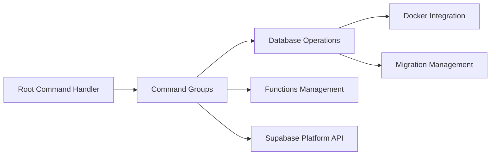

# supabase/cli

> Ligne de commande Supabase : pile locale, migrations, Edge Functions, types, déploiement vers la plateforme.

## Le problème
Développer sur Postgres avec Auth, Storage et Functions en local, puis pousser vers le projet hébergé sans dérive de schéma.

## Ce que ça fait vraiment
`supabase start` lance la pile locale (Postgres, Auth, Realtime, Storage, Edge Functions). `supabase migration`, `db diff`, `db push`, `db reset` gèrent le schéma ; `functions serve/deploy` les fonctions ; `gen types` génère des types TypeScript. Le dépôt est un monorepo pnpm : CLI TypeScript/Bun (`apps/cli`), source Go (`apps/cli-go`), `packages/stack`.

## Comment c'est branché


## Essayer
```bash
npm install -D supabase
supabase init
supabase start
supabase db diff
supabase gen types --local
```

## Coût et pièges
La pile locale demande Docker. Le lien avec un projet hébergé (`supabase login`, `link`) suppose un compte Supabase, offre gratuite et payante. Licence : aucune dans le catalogue, à vérifier. Le README propose aussi un `curl | bash`.

## Ce que ce n'est pas
Ce n'est pas la base de données : c'est l'outil de développement de la plateforme. Utile surtout si tu as déjà choisi Supabase.

## Alternatives
Aucune alternative nommée dans le README.

## Pour toi
À surveiller : intéressant si ton backend d'application IA (auth, stockage, pgvector) repose sur Supabase ; sinon sans objet.
