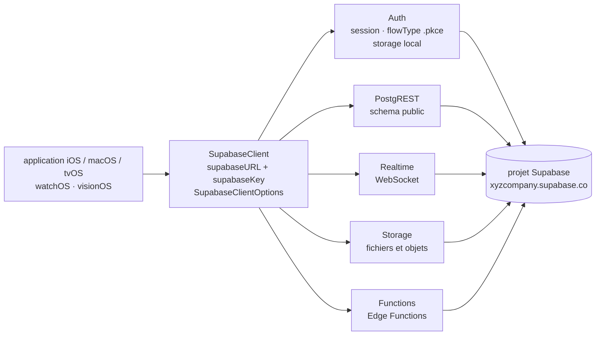

# supabase/supabase-swift

> **Supabase's Swift client SDK, for an Apple application talking to a Supabase project.**

## The problem

Without an SDK, an iOS or macOS app backed by Supabase has to wire four different protocols by
hand: REST over PostgREST for the database, WebSocket for live changes, multipart HTTP for
files, and an authentication state machine with token refresh and local session storage. Each
one is doable alone; together they are tedious and get rewritten on every project.

## What it actually does

The repository publishes a Swift Package Manager package exposing six products, listed as such
in the README: **Supabase** (the full client, which bundles all the others), **Auth** (user
authentication and session management), **PostgREST** (query your Postgres database via REST),
**Realtime** (subscribe to database changes over WebSocket), **Storage** (manage files and
objects) and **Functions** (invoke Supabase Edge Functions). Individual libraries can be added
instead of the full client.

The entry point is `SupabaseClient`, built from a project URL and a publishable key. A
`SupabaseClientOptions` object lets you pick the database schema (`schema: "public"`), plug in
your own session storage (`storage: MyCustomLocalStorage()`), force the PKCE authentication
flow (`flowType: .pkce`), add global HTTP headers and swap the transport for your own
`URLSession`. Fuller examples are deferred to the repository's `Examples/` directory and are
not detailed in the README.

The rest of the README is an explicit support policy (see below) and the contribution steps.

## How it is wired



No code-derived diagram exists for this repository: this one is reconstructed from the README
alone, from the library table and the two initialisation snippets. It shows the main point —
the six modules do not talk to each other, they share the URL and key carried by
`SupabaseClient` and each reach the same remote server.

## Trying it

The README gives no shell installation command: the package is added through Swift Package
Manager by declaring the dependency in `Package.swift`.

```swift
let package = Package(
    ...
    dependencies: [
        .package(
            url: "https://github.com/supabase/supabase-swift.git",
            from: "2.0.0"
        ),
    ],
    targets: [
        .target(
            name: "YourTargetName",
            dependencies: [
                .product(name: "Supabase", package: "supabase-swift")
            ]
        )
    ]
)
```

```swift
let client = SupabaseClient(
    supabaseURL: URL(string: "https://xyzcompany.supabase.co")!,
    supabaseKey: "your-publishable-key"
)
```

In Xcode, the README points to Apple's package-adding guide with the same URL. The only shell
commands present concern contributing:

```bash
./scripts/format.sh
PLATFORM=IOS XCODEBUILD_ARGUMENT=test ./scripts/xcodebuild.sh
```

## Cost and pitfalls

- **You need a Supabase project.** The client requires a `supabaseURL` and a `supabaseKey`:
  with no hosted (or self-hosted) backend, the library does nothing. Service pricing is not
  covered in the README — check it elsewhere before committing. The SDK code itself is MIT.
- **A recent Apple toolchain is required**: iOS 16.0+ / macOS 13.0+ / tvOS 16+ / watchOS 9+ /
  visionOS 1+, **Xcode 26.0+** and **Swift 6.2+**. That is the real filter: an older machine or
  deployment target is out of spec.
- **A deliberate deprecation policy**: dropping an Xcode, Swift or platform version is **not**
  treated as a breaking change and can land in a minor release. Supabase supports only Xcode
  versions still accepted by the App Store and the four latest major versions of each platform.
  Pinning versions is not optional.
- **Android, Linux and Windows "work" but are not officially supported** and may stop working
  in future versions — the README says so in a callout.
- The key handed to the client is described as *publishable*; nothing in the README documents
  server-side secret handling.

## What it is not

- **It is not Supabase.** It is a client; all the logic — Postgres, RLS policies, Edge
  Functions, buckets — lives in the remote project. The repository holds no server, no
  migration, no admin tooling.
- **It is not an ORM or a local persistence layer**: no offline cache, no documented
  synchronisation. `Realtime` listens on a WebSocket, it reconciles nothing.
- **It is not cross-platform in the usual sense**: despite Swift, only Apple platforms are
  officially supported.
- **It is not a frozen SDK**: the support policy announces version removals in minor releases,
  which cuts against the common reading of semantic versioning.

## Alternatives

No comparable alternative in the catalogue. The suggested neighbours — `pingcap/tidb` (a
distributed database), `onevcat/Kingfisher` (image loading), `Juanpe/SkeletonView` (loading
animations) and `Dimillian/IceCubesApp` (a Mastodon client) — are near it only through the
Swift or "database" vocabulary, and none is a backend-as-a-service client SDK. The README names
no competing project: it only links to Supabase's own guides and reference documentation.

## For you

Ignore it for data / AI / MLOps work: this is an Apple mobile application SDK, unrelated to
training, model serving or data orchestration. The one case worth a look is an iOS demo sitting
on top of an existing Supabase backend — and there it is the Supabase project, not this
library, that deserves the attention.
