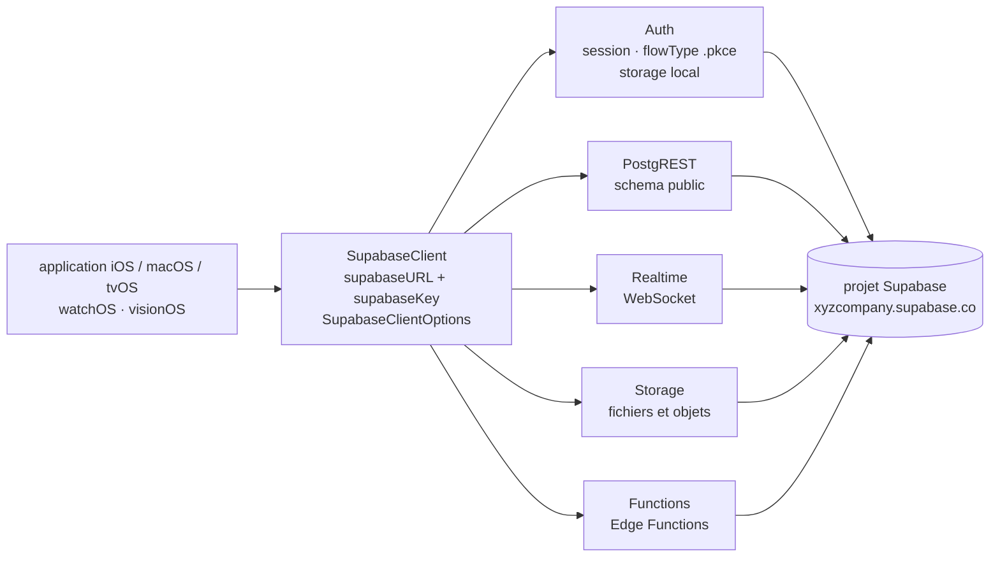

# supabase/supabase-swift

> **Le SDK client Swift de Supabase, pour une application Apple qui parle à un projet Supabase.**

## Le problème

Sans SDK, une application iOS ou macOS qui s'adosse à Supabase doit câbler à la main quatre
protocoles différents : REST sur PostgREST pour la base, WebSocket pour les changements en
direct, HTTP multipart pour les fichiers, et une machine à états d'authentification avec
rafraîchissement de jeton et stockage local de session. Chacun est faisable seul, l'ensemble
est fastidieux et se re-écrit à chaque projet.

## Ce que ça fait vraiment

Le dépôt publie un paquet Swift Package Manager qui expose six produits, listés tels quels
dans le README : **Supabase** (le client complet, qui embarque tous les autres), **Auth**
(authentification et gestion de session), **PostgREST** (interroger la base Postgres par
REST), **Realtime** (s'abonner aux changements de la base par WebSocket), **Storage** (gérer
fichiers et objets) et **Functions** (invoquer les Edge Functions Supabase). On peut ajouter
un seul de ces produits plutôt que le client complet.

Le point d'entrée est `SupabaseClient`, construit avec une URL de projet et une clé
publiable. Un objet `SupabaseClientOptions` permet de choisir le schéma de base (`schema:
"public"`), de brancher un stockage de session maison (`storage: MyCustomLocalStorage()`),
de forcer le flux d'authentification PKCE (`flowType: .pkce`), d'ajouter des en-têtes HTTP
globaux et de remplacer le transport par une `URLSession` à soi. Des exemples complets sont
renvoyés au répertoire `Examples/` du dépôt, non détaillés dans le README.

Le reste du README est une politique de support explicite (voir plus bas) et les étapes de
contribution.

## Comment c'est branché



Aucun diagramme tiré du code n'existe pour ce dépôt : ce schéma est reconstruit depuis le
seul README, à partir du tableau des bibliothèques et des deux exemples d'initialisation. Il
dit l'essentiel : les six modules ne se parlent pas entre eux, ils partagent l'URL et la clé
portées par `SupabaseClient` et vont chacun au même serveur distant.

## Essayer

Le README ne donne aucune commande shell d'installation : l'ajout se fait par Swift Package
Manager, en déclarant la dépendance dans `Package.swift`.

```swift
let package = Package(
    ...
    dependencies: [
        .package(
            url: "https://github.com/supabase/supabase-swift.git",
            from: "2.0.0"
        ),
    ],
    targets: [
        .target(
            name: "YourTargetName",
            dependencies: [
                .product(name: "Supabase", package: "supabase-swift")
            ]
        )
    ]
)
```

```swift
let client = SupabaseClient(
    supabaseURL: URL(string: "https://xyzcompany.supabase.co")!,
    supabaseKey: "your-publishable-key"
)
```

Sous Xcode, le README renvoie à la procédure d'Apple pour ajouter un paquet, avec la même URL.
Les seules commandes shell présentes concernent la contribution :

```bash
./scripts/format.sh
PLATFORM=IOS XCODEBUILD_ARGUMENT=test ./scripts/xcodebuild.sh
```

## Coût et pièges

- **Il faut un projet Supabase.** Le client réclame une `supabaseURL` et une
  `supabaseKey` : sans backend hébergé (ou auto-hébergé), la bibliothèque ne fait rien. Les
  tarifs du service ne sont pas abordés dans le README — à vérifier ailleurs avant de
  s'engager. Le code du SDK, lui, est sous licence MIT.
- **Chaîne d'outils Apple récente exigée** : iOS 16.0+ / macOS 13.0+ / tvOS 16+ / watchOS 9+
  / visionOS 1+, **Xcode 26.0+** et **Swift 6.2+**. C'est le vrai filtre : un poste ou une
  cible de déploiement plus anciens sont hors spécification.
- **Politique de dépréciation assumée** : abandonner une version de Xcode, de Swift ou d'une
  plateforme n'est **pas** traité comme une rupture et peut arriver dans une version mineure.
  Supabase ne supporte que les Xcode encore acceptés par l'App Store et les quatre dernières
  versions majeures de chaque plateforme. Épingler ses versions n'est pas facultatif.
- **Android, Linux et Windows « fonctionnent » mais ne sont pas officiellement supportés** et
  peuvent cesser de fonctionner dans une version ultérieure — le README le dit en encadré.
- La clé passée au client est décrite comme *publishable* : rien dans le README ne documente
  la gestion des secrets côté serveur.

## Ce que ce n'est pas

- **Ce n'est pas Supabase.** C'est un client ; toute la logique — Postgres, politiques RLS,
  Edge Functions, buckets — vit dans le projet distant. Le dépôt ne contient ni serveur, ni
  migration, ni outil d'administration.
- **Ce n'est pas un ORM ni une couche de persistance locale** : pas de cache hors ligne, pas
  de synchronisation documentée. `Realtime` écoute un WebSocket, il ne réconcilie rien.
- **Ce n'est pas multiplateforme au sens habituel** : malgré Swift, seules les plateformes
  Apple sont supportées officiellement.
- **Ce n'est pas un SDK figé** : la politique de support annonce des retraits de versions dans
  des releases mineures, ce qui va à l'encontre de la lecture courante du versionnage
  sémantique.

## Alternatives

Aucune alternative comparable dans le catalogue. Les voisins proposés — `pingcap/tidb` (base
de données distribuée), `onevcat/Kingfisher` (chargement d'images) , `Juanpe/SkeletonView`
(animations de chargement) et `Dimillian/IceCubesApp` (client Mastodon) — sont rapprochés par
le lexique Swift ou « base de données », mais aucun n'est un SDK client d'un backend-as-a-service.
Le README ne nomme aucun projet concurrent : il ne renvoie qu'aux guides et à la
documentation de référence de Supabase.

## Pour toi

À ignorer pour un usage data / IA / MLOps : c'est un SDK d'application mobile Apple, sans
rapport avec l'entraînement, le service de modèles ou l'orchestration de données. Le seul cas
qui justifierait d'y regarder est une démonstration iOS posée devant un backend Supabase déjà
en place — et là, c'est le projet Supabase, pas cette bibliothèque, qui demande l'attention.
