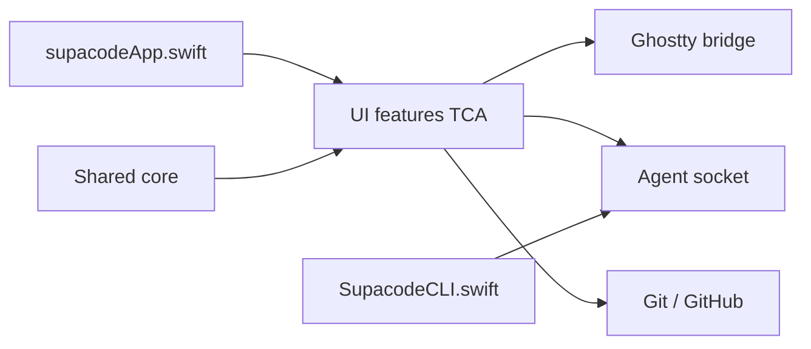

# supabitapp/supacode

> Application macOS native pour lancer plusieurs agents de code en parallèle, chacun dans son worktree git.

## Le problème
Faire tourner plusieurs agents de code en parallèle mène à des collisions de fichiers et à des sessions perdues à la fermeture du terminal.

## Ce que ça fait vraiment
Chaque tâche reçoit son worktree git et un vrai terminal (libghostty). Les sessions tournent dans le démon zmx et survivent à la fermeture de l'app ou d'une connexion SSH. Elle détecte l'agent (Claude, Codex, Copilot) via des hooks qu'elle installe, affiche l'état et notifie. Une CLI `supacode` et des deeplinks pilotent l'app ; suivi des PR GitHub dans la barre latérale.

## Comment c'est branché


## Essayer
```bash
git clone --recursive git@github.com:supabitapp/supacode.git
cd supacode
mise install
make doctor
make run-app
```

## Coût et pièges
Gratuit mais macOS 26.0+ exigé ; compilation de GhosttyKit avec Zig, et Xcode 26.3 requis sur macOS 26.4+. L'architecture montre télémétrie et rapports de crash dans l'app.

## Ce que ce n'est pas
Ni un agent ni un orchestrateur de modèles : c'est une interface de terminal autour d'agents existants. Non disponible hors macOS.

## Alternatives
- Aucune alternative nommée dans le README.

## Pour toi
Ignorer sauf si tu es sous macOS 26 et lances beaucoup d'agents en parallèle ; licence non identifiée et build lourd.
