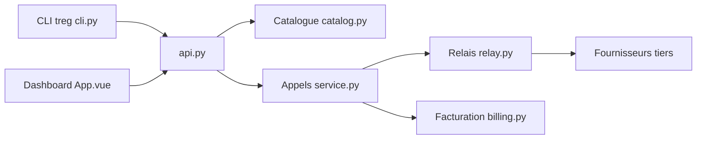

# superdesigndev/treg

> Registre et proxy d'outils pour agents : un jeton, un catalogue d'API facturées à l'appel, pour équipes.

## Le problème
Un agent qui a besoin de données SEO, d'enrichissement ou de scraping exige un compte et une clé par fournisseur, et les clés d'équipe circulent en clair.

## Ce que ça fait vraiment
Le serveur résout l'outil par l'hôte de l'URL, déchiffre le secret (Fernet), l'injecte dans la requête, relaie la réponse en flux et écrit un journal d'audit. Un catalogue de milliers de points d'accès est facturé au centime sur un solde prépayé ; une clé propre à l'équipe prime et n'est pas facturée. Il gère aussi des CLI, des skills, des équipes et des rôles, un plugin Claude Code et un connecteur MCP.

## Comment c'est branché


## Essayer
```bash
curl -fsSL https://treg.to/install.sh | sh
treg login
treg catalog search "backlinks for a domain"
treg balance
uv sync
uv run python -m treg
```

## Coût et pièges
Le service hébergé (treg.to) exige un compte ; 1 $ offert une fois, puis solde prépayé. Auto-hébergement possible : perdre `TREG_SECRET_KEY` rend les secrets irrécupérables. Le CLI envoie des statistiques d'usage à PostHog, désactivables (`TREG_TELEMETRY=0`).

## Ce que ce n'est pas
Pas un simple client : le service centralise des clés et des paiements, donc de la confiance. Un catalogue sans prix publié est refusé. Le projet date de juillet 2026, la licence n'est pas reconnue par GitHub, 90 issues ouvertes.

## Alternatives
Aucune alternative n'est citée dans le README (seule une analogie avec OpenRouter, côté modèles).

## Pour toi
À surveiller : l'idée d'injecter les secrets côté serveur est saine pour des agents d'équipe, mais projet très jeune, licence à clarifier et dépendance à un service hébergé.
