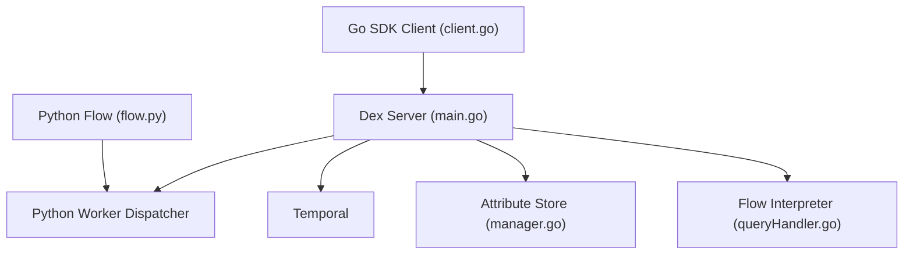

# superdurable/dex

> Framework d'exécution durable bâti sur Temporal, pensé pour agents IA et processus humain+IA.

## Le problème
Un workflow long (agents, attentes d'événements, timers) doit survivre aux pannes et redémarrages sans réécrire la reprise à la main.

## Ce que ça fait vraiment
Tu écris un Flow en code ordinaire avec Steps, Attributes, RPCs, Channels et Timers durables ; des Workers l'hébergent, un Client démarre les instances, le Dex Server distribue les tâches. Ajoute du streaming en mémoire, un stockage d'attributs et le déchargement des gros payloads vers un blob storage. SDK Go, Python, TypeScript, Java ; CLI et interface web. Le README annonce une bêta.

## Comment c'est branché

## Essayer
Aucune commande dans le README ; renvoi au Quick start sur docs.superdurable.io.

## Coût et pièges
Gratuit, mais repose sur Temporal à héberger ; installation non documentée ici. Bêta : API susceptible de retouches mineures.

## Ce que ce n'est pas
Pas un framework d'agents LLM : c'est une couche d'orchestration durable. Pas un remplaçant de Temporal, qu'il étend.

## Alternatives
Temporal, cité comme la plateforme de référence dont Dex part.

## Pour toi
Surveiller : utile pour des pipelines/agents longs et fiables, mais bêta, licence non identifiée et dépendance à Temporal.

