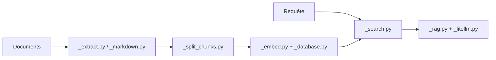

# superlinear-ai/raglite

> Boîte à outils Python pour RAG sur DuckDB ou PostgreSQL, sans PyTorch ni LangChain.

## Le problème
Monter un RAG correct (PDF, découpage, recherche hybride, reranking) implique d'assembler beaucoup de briques lourdes.

## Ce que ça fait vraiment
Convertit les documents en Markdown, découpe par programmation entière (phrases et chunks sémantiques), embarque en multi-vecteurs avec late chunking, cherche en hybride (FTS + vecteurs) puis rerank (FlashRank par défaut). RAG adaptatif où le LLM décide de récupérer, adaptateur de requête, évaluation Ragas, serveur MCP et front Chainlit. LLM via LiteLLM ou llama-cpp-python en local.

## Comment c'est branché


## Essayer
```bash
pip install raglite
pip install raglite[chainlit]
raglite --db-url duckdb:///raglite.db --llm gpt-4o-mini --embedder text-embedding-3-large chainlit
```
Le README détaille la configuration `RAGLiteConfig` et `insert_documents`.

## Coût et pièges
Avec un LLM distant, clé d'API à ta charge ; en local, poids GGUF à télécharger, binaire llama-cpp-python accéléré recommandé. PostgreSQL possible via un service tiers.

## Ce que ce n'est pas
Pas une plateforme de RAG clé en main ni un service géré. Licence MPL-2.0 : copyleft faible sur les fichiers modifiés.

## Alternatives
Le README cite LiteLLM et rerankers comme briques, pas comme concurrents.

## Pour toi
À adopter pour un prototype RAG léger et local : dépendances sobres, recherche hybride et évaluation incluses.
