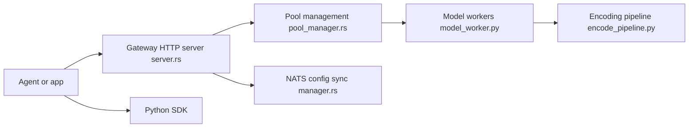

# superlinked/sie

> Moteur d'inférence auto-hébergé servant plus de 100 modèles (embeddings, OCR, extraction, génération) via une seule API.

## Le problème
Chaque tâche d'un agent (recherche, OCR, extraction, garde-fous, traduction) tend à avoir son propre serveur de modèle.

## Ce que ça fait vraiment
Un serveur charge les modèles à la demande avec éviction LRU et expose une API compatible OpenAI (`/v1/embeddings`, `/v1/chat/completions`, `/v1/responses`). Un catalogue couvre recherche (bge-m3, SPLADE, ColBERT), document vers Markdown, sortie structurée, garde-fou, traduction, vision, transcription. SDK Python et TypeScript, intégrations LangChain, LlamaIndex, Haystack, Qdrant, Weaviate…, passerelle Kubernetes/Helm avec KEDA.

## Comment c'est branché


## Essayer
```bash
pip install "sie-server[local]" && sie-server serve
docker run --gpus all -p 8080:8080 -v sie-hf-cache:/app/.cache/huggingface ghcr.io/superlinked/sie-server:latest-cuda12-default
curl http://localhost:8080/readyz
pip install sie-sdk
```

## Coût et pièges
Les images Docker sont par bundle de modèles (CUDA, CPU, SGLang…). Python 3.12 en natif. Premier appel d'un modèle = téléchargement des poids. Télémétrie anonyme, désactivable (`SIE_TELEMETRY_DISABLED=1`).

## Ce que ce n'est pas
Pas un hébergeur managé : tu opères toi-même GPU et cluster. Les performances ne sont pas chiffrées dans le README.

## Alternatives
Aucune alternative nommée dans le README.

## Pour toi
À adopter pour consolider tes modèles d'embedding et de reranking derrière une API unique ; Apache 2.0 et déploiement Kubernetes prêt.

