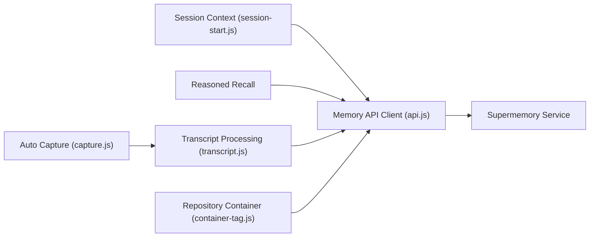

# supermemoryai/claude-supermemory

> Plugin Claude Code qui donne une mémoire persistante aux sessions via le service Supermemory.

## Le problème
Claude Code oublie tout d'une session à l'autre et d'un projet à l'autre.

## Ce que ça fait vraiment
Des hooks Node chargent un profil de mémoire au démarrage, décident avant chaque tour si un rappel est utile, et capturent la conversation en fin de session. Les mémoires sont rangées dans un conteneur par dépôt (dérivé du remote git), partagé avec Codex et OpenCode ; une mémoire d'équipe est séparée des souvenirs personnels. Commandes : `index`, `project-config`, `status`, `session`, `logout`.

## Comment c'est branché


## Essayer
```bash
/plugin marketplace add supermemoryai/claude-supermemory
/plugin install supermemory
export SUPERMEMORY_CC_API_KEY="sm_..."
```

## Coût et pièges
Clé d'API Supermemory (console.supermemory.ai) ; les conversations sont envoyées à leur service. Le README renvoie à la politique de confidentialité pour la rétention.

## Ce que ce n'est pas
Pas un stockage local : sans le service Supermemory, rien ne fonctionne. Aucune licence déclarée au catalogue.

## Alternatives
Aucune alternative nommée dans le README.

## Pour toi
À surveiller : pratique, mais tes sessions de code partent chez un tiers et la licence est absente ; préfère une mémoire locale si tes dépôts sont sensibles.

