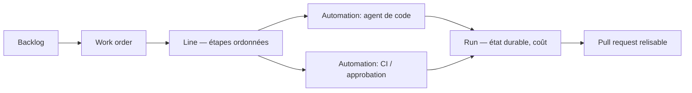

# superplanehq/superplane

> Moteur qui fait traiter par des agents les tickets de backlog jugés sûrs, jusqu'à la PR.

## Le problème
Déléguer une tâche à un agent de code oblige à gérer soi-même l'enchaînement : brancher, lancer
la CI, relire, approuver, renvoyer l'échec à l'agent avec assez de contexte pour qu'il corrige.

## Ce que ça fait vraiment
Le vocabulaire est celui d'une usine. Une **Factory** détient les ordres de travail, les lignes
d'automatisation et les politiques d'une équipe. Un **work order** trace une tâche déléguée de
l'entrée au résultat final. Une **line** définit les étapes ordonnées ; une **automation** lance
un agent, appelle un outil, attend un événement ou exige une approbation ; un **run** enregistre
l'exécution durable, entrées, sorties, reprises et coût. Le système évalue en continu quels
tickets les agents peuvent traiter avec confiance et renvoie les échecs à l'agent.

## Comment c'est branché


## Essayer
```bash
# Aucune commande documentée dans le README : il décrit le modèle de ressources
# et renvoie à la page des intégrations.
```

## Coût et pièges
Moteur sous Apache 2.0, mais le README ne dit pas ce qui reste hors du moteur ni comment il se
déploie — ni installation, ni configuration. Les agents consomment des modèles facturés (Claude,
Cursor, OpenAI, OpenRouter, Perplexity) : le coût par run est suivi, pas supprimé. Chaque
intégration citée suppose un compte tiers.

## Ce que ce n'est pas
Ce n'est pas un agent de code : il coordonne ceux que tu choisis. Ce n'est pas fait pour le
travail ambigu — le README réserve explicitement aux humains les décisions de jugement.
Aucun élément mesurable sur la qualité des PR produites.

## Alternatives
Aucune alternative nommée dans le README.

## Pour toi
Idée intéressante à suivre, mais sans instructions de déploiement, rien à essayer aujourd'hui.
