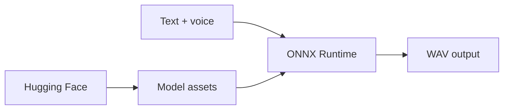

# supertone-inc/supertonic

> Synthèse vocale locale de 99M paramètres via ONNX Runtime, 31 langues, sans GPU ni cloud.

## Le problème
Les API de synthèse vocale envoient le texte à un tiers et facturent à l'usage.

## Ce que ça fait vraiment
Des poids ONNX (~99M paramètres) et des exemples dans onze environnements : Python, Node, navigateur, Java, C++, C#, Go, Swift, iOS, Rust, Flutter. Sortie WAV 44,1 kHz, 10 balises d'expression. Pas de clonage de voix dans la version ouverte.

## Comment c'est branché


## Essayer
```bash
git clone https://github.com/supertone-oss-archive/supertonic.git
cd supertonic
python3.11 -m venv .venv
source .venv/bin/activate
python -m pip install huggingface_hub
hf download supertone-oss-archive/supertonic-3 --revision aafc6e32416a594460b32413efc49d7fe4ce6d46 --local-dir assets
python -m pip install -r py/requirements.txt
cd py
python example_onnx.py --n-test 1 --text "Hello" --lang en
```

## Coût et pièges
Gratuit, téléchargement des poids (archive Hugging Face). Le dépôt est archivé : aucune mise à jour ni correctif de sécurité.

## Ce que ce n'est pas
Pas un service maintenu : Voice Builder a fermé fin août 2026. Anomalie : le catalogue indique « archivé : non » alors que le README annonce l'archivage. La licence du code et celle des poids ne sont pas précisées.

## Alternatives
Le tableau du README compare avec VoxCPM2, OmniVoice et Qwen3-TTS (WER/CER).

## Pour toi
À surveiller : correct pour tester de la synthèse locale sans GPU, mais sans support ni évolution, donc à ne pas mettre au cœur d'un produit.
