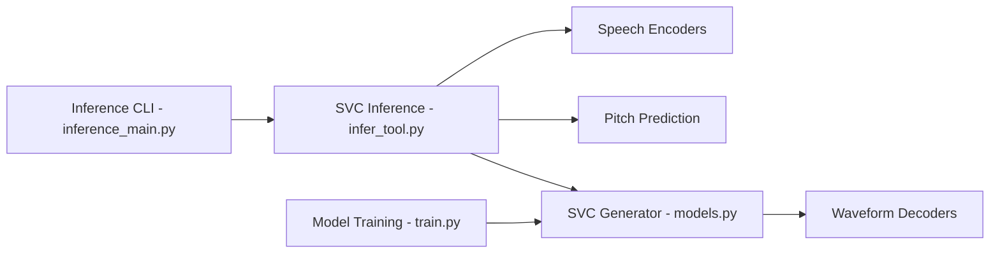

# svc-develop-team/so-vits-svc

> Cadre d'entraînement et d'inférence de conversion de voix chantée, aujourd'hui archivé.

## Le problème
Faire chanter une voix cible à partir d'un enregistrement chanté, sans passer par le texte.

## Ce que ça fait vraiment
Un encodeur de contenu (ContentVec, HuBERT, Whisper-PPG…) extrait des traits que VITS convertit en conservant hauteur et intonation, avec un vocodeur NSF-HiFiGAN. Options : diffusion « superficielle », récupération de traits (RVC), clustering de timbre, mélange de voix, export ONNX. Il faut entraîner ses propres modèles : aucun n'est fourni.

## Comment c'est branché


## Essayer
```bash
python resample.py
python preprocess_flist_config.py --speech_encoder vec768l12
python preprocess_hubert_f0.py --f0_predictor dio
python train.py -c configs/config.json -m 44k
python inference_main.py -m "logs/44k/G_30400.pth" -c "configs/config.json" -n "君の知らない物語-src.wav" -t 0 -s "nen"
```

## Coût et pièges
GPU et données propres requis ; Python 3.8.9 testé. Dépôt archivé depuis novembre 2023, AGPL-3.0. Droits sur les jeux de données et sur les voix à la charge de l'utilisateur.

## Ce que ce n'est pas
Pas du TTS. Pas un produit prêt à l'emploi ni destiné à la production (usage « académique » selon le README). Risques juridiques sur les voix réelles.

## Alternatives
- 34j/so-vits-svc-fork : fork à l'interface améliorée.
- w-okada/voice-changer : client de conversion en temps réel.
- MoeVoiceStudio : studio avec éditeur de f0 (modèles ONNX).

## Pour toi
À ignorer : archivé, AGPL et risque légal sur les voix ; partir des forks cités si le besoin est réel.

