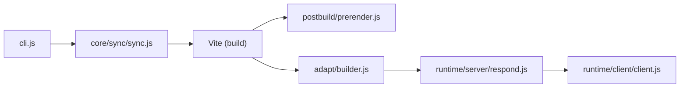

# sveltejs/kit

> Framework web pour applications Svelte, avec routage par fichiers, rendu serveur et adaptateurs de déploiement.

## Le problème
Assembler routage, rendu côté serveur, formulaires et déploiement pour une appli Svelte demande beaucoup de colle.

## Ce que ça fait vraiment
Monorepo dont le cœur est `packages/kit`, accompagné d'adaptateurs (auto, Cloudflare, Netlify, Node, static, Vercel), de `enhanced-img` et de `package`. D'après l'architecture décrite : une étape de synchronisation lit les routes et génère les manifestes ; Vite construit les bundles ; un crawler peut prérendre ; un adaptateur produit la sortie de la plateforme cible. À l'exécution, `respond.js` route vers endpoints, pages et actions, le client gère navigation et fonctions distantes.

## Comment c'est branché

## Essayer
Le README ne contient aucune commande d'installation de SvelteKit ; il cite seulement `npm create vite@latest` et `npm create vite-extra@latest` pour reproduire un bug lié à Vite.

## Coût et pièges
Gratuit. Beaucoup de problèmes de build viennent de Vite, à signaler à part. README très court : la documentation est externe.

## Ce que ce n'est pas
Pas un outil de visualisation ni de données. Ce n'est pas un back-end de modèles.

## Alternatives
Aucune alternative citée dans le README.

## Pour toi
Ignorer : framework front-end généraliste ; à revisiter seulement pour bâtir une interface web sur tes modèles si Svelte est déjà ton choix.

