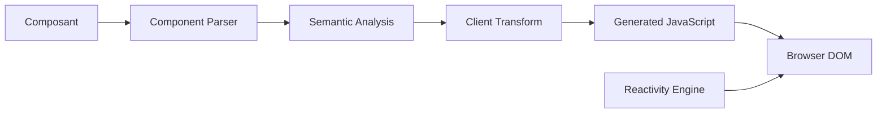

# sveltejs/svelte

> Compilateur qui transforme des composants déclaratifs en JavaScript mettant à jour le DOM, pour développeurs front-end.

## Le problème
Éviter un runtime de framework lourd pour mettre à jour l'interface.

## Ce que ça fait vraiment
README minimal : Svelte est un compilateur de composants vers du JavaScript qui modifie le DOM. D'après l'architecture : parseur, analyse sémantique, transformations client, serveur et CSS, préprocesseur, migration, runtime de réactivité, rendu serveur.

## Comment c'est branché

## Essayer
Aucune commande documentée dans ce README.

## Coût et pièges
Rien de documenté. Le README renvoie au site et à Discord.

## Ce que ce n'est pas
README trop court (moins de 800 caractères) pour juger : installation, syntaxe et limites ne sont pas décrites ici.

## Alternatives
Aucune alternative nommée dans le README.

## Pour toi
Surveiller : peu utile pour un profil data/IA, sauf pour bâtir un tableau de bord ; matière trop mince ici pour trancher davantage.

