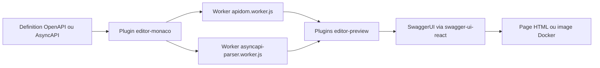

# swagger-api/swagger-editor

> **A browser-based API description editor** with live preview, for people writing OpenAPI or AsyncAPI.

## The problem

Writing an OpenAPI or AsyncAPI document in a plain text editor means finding out about structural
mistakes only when some downstream tool rejects the file, and never seeing what the rendered
documentation will look like until it has been published.

## What it actually does

A React application that puts a Monaco editor next to a rendered preview of the document being
edited. The README claims support for OpenAPI 2.0, 3.0, 3.1, 3.2 and AsyncAPI 2.x and 3.x, in
both JSON and YAML, including `x-` specification extensions. Two syntax highlighting modes exist:
a regex-based Monarch mode, on by default, and an ApiDOM semantic-token mode enabled with
`EditorMonacoLanguageApiDOMPlugin({ useApiDOMSyntaxHighlighting: true })`. The README states
plainly that SwaggerEditor is just a set of SwaggerUI plugins used with `swagger-ui-react`.
Roughly twenty plugins, from `dropzone` to `editor-preview-asyncapi`, can be imported one by one,
and two presets (`textarea`, `monaco`) bundle them.

## How it is wired



The edited document goes through the `editor-monaco` plugin, which offloads parsing to Web Workers
shipped in `dist/umd/`: `apidom.worker.js`, `editor.worker.js`, `asyncapi-parser.worker.js`. They
are why the README's webpack config declares dedicated entries, `stream-http`, `https-browserify`
and `buffer` fallbacks, and a `file-loader` rule for `.wasm` files, since webpack's default WASM
handling does not work inside a worker. The `editor-preview` plugins then render the result
through SwaggerUI. The `swagger-ui-adapter` plugin allows the reverse path: plugging the preview
plugins into an existing SwaggerUI instance.

## Trying it

```bash
$ docker pull docker.swagger.io/swaggerapi/swagger-editor:latest
$ docker run -d -p 8080:80 docker.swagger.io/swaggerapi/swagger-editor:latest
```

Then open `http://localhost:8080/`. As an npm package: `npm install swagger-editor@alpha`. From
source: `git clone https://github.com/swagger-api/swagger-editor.git`, `npm i`, `npm start`;
`npm run build` builds the artifacts, and `npm run build:app` plus `npm run build:app:serve`
serve the standalone app on `http://localhost:3050/`.

## Cost and traps

Nothing to pay, but the install is demanding: the README requires node-gyp with Python 3.x,
GLIBC `>=2.29`, and either emscripten or Docker (it recommends Docker). Development needs
Node.js `>=24.18.0` and npm `>=11.16.0`. Bundling the package commonly triggers
`Reached heap limit Allocation failed`, worked around with
`export NODE_OPTIONS="--max_old_space_size=4096"`. The npm package only installs under the
`alpha` tag. Installation also sends anonymized analytics through Scarf, disabled with
`scarfSettings.enabled: false` in `package.json` or `SCARF_ANALYTICS=false`. The catalogue
records no declared license even though the README states Apache 2.0 under the REUSE
specification: check the repository before any contractual use.

## What it is not

Not a validation engine or a command-line linter: nothing in the README describes a CLI that
returns an exit code on a definition. Not a client or server code generator from the contract.
Not a hosted service provided by the repository either: you run it yourself, as a Docker image
or an npm package. And not a standalone project, but a plugin layer on top of SwaggerUI, whose
constraints it inherits, down to the plug points documentation that points back to the
swagger-ui repository.

## Alternatives

`swagger-api/swagger-ui` is named throughout the README and is the foundation this editor is
built on: to merely display a definition without editing it, that is the one to use. The README
also mentions the `swagger-ui-react` and `swagger-ui-dist` packages. Among the catalogue
neighbours, kubescape/kubescape, infobyte/faraday and Ullaakut/cameradar are security tools with
no bearing on API contract editing.

## For you

Useful the day you expose an API and want to reread its contract with a preview alongside,
without publishing. The cheapest route is the Docker image: two commands, no build chain to set
up. Embedding the npm package into your own application is a different budget entirely — workers,
webpack fallbacks, an enlarged Node heap, an alpha tag. Worth watching rather than adopting as a
foundation.
