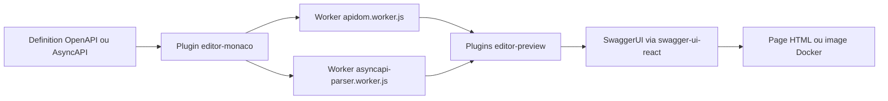

# swagger-api/swagger-editor

> **Éditeur web de descriptions d'API**, avec aperçu du rendu, pour qui écrit de l'OpenAPI ou de l'AsyncAPI.

## Le problème

Écrire une description OpenAPI ou AsyncAPI à la main dans un éditeur de texte ordinaire, c'est
n'apprendre ses erreurs de structure qu'au moment où un outil aval refuse le fichier, et ne
jamais voir à quoi ressemblera la documentation produite avant de l'avoir publiée.

## Ce que ça fait vraiment

C'est une application React qui met côte à côte un éditeur Monaco et un aperçu rendu du document
en cours d'édition. Le README annonce la prise en charge d'OpenAPI 2.0, 3.0, 3.1, 3.2 et
d'AsyncAPI 2.x et 3.x, en JSON comme en YAML, extensions `x-` comprises. Deux modes de coloration
syntaxique cohabitent : un mode simplifié par expressions régulières (Monarch), actif par défaut,
et un mode ApiDOM à jetons sémantiques, à activer avec
`EditorMonacoLanguageApiDOMPlugin({ useApiDOMSyntaxHighlighting: true })`.
Le README le dit lui-même : SwaggerEditor n'est qu'un ensemble de plugins SwaggerUI utilisés avec
`swagger-ui-react`. Ces plugins — une vingtaine listés, de `dropzone` à `editor-preview-asyncapi` —
sont importables un par un, et deux presets (`textarea`, `monaco`) les regroupent.

## Comment c'est branché



Le document édité passe par le plugin `editor-monaco`, qui délègue l'analyse à des Web Workers
livrés dans `dist/umd/` : `apidom.worker.js`, `editor.worker.js`, `asyncapi-parser.worker.js`.
C'est pour eux que la config webpack du README déclare des entrées dédiées, des fallbacks
`stream-http`, `https-browserify`, `buffer`, et un `file-loader` sur les `.wasm` — le chargement
WASM par défaut de webpack ne fonctionnant pas dans un worker. Les plugins `editor-preview`
rendent ensuite le résultat à travers SwaggerUI. Le plugin `swagger-ui-adapter` permet le chemin
inverse : brancher les plugins d'aperçu directement dans une instance SwaggerUI existante.

## Essayer

```bash
$ docker pull docker.swagger.io/swaggerapi/swagger-editor:latest
$ docker run -d -p 8080:80 docker.swagger.io/swaggerapi/swagger-editor:latest
```

Puis `http://localhost:8080/`. En paquet npm : `npm install swagger-editor@alpha`. En local,
depuis les sources : `git clone https://github.com/swagger-api/swagger-editor.git`, `npm i`,
`npm start` ; le build passe par `npm run build`, la démo standalone par `npm run build:app` puis
`npm run build:app:serve` sur `http://localhost:3050/`.

## Coût et pièges

Rien à payer, mais l'installation est exigeante : le README réclame node-gyp avec Python 3.x,
GLIBC `>=2.29`, et emscripten **ou** Docker — il recommande Docker. Pour le développement,
Node.js `>=24.18.0` et npm `>=11.16.0`. Le bundling du paquet déclenche couramment un
`Reached heap limit Allocation failed`, à contourner par
`export NODE_OPTIONS="--max_old_space_size=4096"`. Le paquet npm ne s'installe qu'en tag `alpha`.
Enfin, l'installation envoie des statistiques anonymisées via Scarf ; on les coupe avec
`scarfSettings.enabled: false` dans `package.json` ou `SCARF_ANALYTICS=false`. Le catalogue ne
relève aucune licence déclarée alors que le README annonce Apache 2.0 sous spécification REUSE :
à vérifier dans le dépôt avant usage contractuel.

## Ce que ce n'est pas

Ce n'est pas un moteur de validation ni un linter en ligne de commande : rien dans le README ne
décrit de CLI qui rendrait un code de sortie sur une définition. Ce n'est pas non plus un
générateur de code client ou serveur à partir du contrat. Ce n'est pas un service hébergé fourni
par le dépôt : on installe soi-même, en image Docker ou en paquet npm. Et ce n'est pas un projet
autonome — c'est une surcouche de plugins à SwaggerUI, dont il hérite les contraintes, jusqu'à
la documentation des plug points qui renvoie au dépôt swagger-ui.

## Alternatives

`swagger-api/swagger-ui` est nommé partout dans le README, et c'est la brique sur laquelle cet
éditeur est construit : pour seulement afficher une définition sans l'éditer, c'est lui qu'il
faut. Le README mentionne aussi les paquets `swagger-ui-react` et `swagger-ui-dist`. Parmi les
voisins proposés par le catalogue, kubescape/kubescape, infobyte/faraday et Ullaakut/cameradar
sont des outils de sécurité sans rapport avec l'édition de contrats d'API.

## Pour toi

Utile le jour où tu exposes une API et veux relire son contrat avec l'aperçu à côté, sans
publier. La voie la moins coûteuse est l'image Docker : deux commandes, aucune chaîne de build
à monter. Intégrer le paquet npm dans une application maison est un autre budget — workers,
fallbacks webpack, heap Node à rallonger, tag alpha. À surveiller plutôt qu'à adopter en socle.
