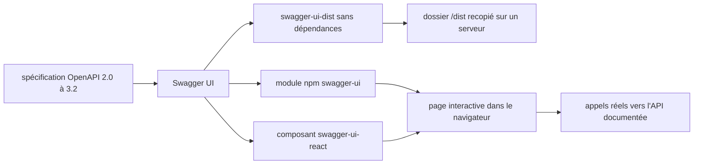

# swagger-api/swagger-ui

> **API docs you can read and actually call.** Turns an OpenAPI spec into a browsable, callable page.

## The problem

Without it, an OpenAPI specification stays a JSON or YAML file nobody reads: the backend team
hand-writes a documentation page, and API consumers have no way to try a call before writing
a client.

## What it actually does

Per the README, the page is generated automatically from the OpenAPI (formerly Swagger)
specification and lets anyone visualize and interact with the API's resources without having
the implementation logic in place. The repository publishes three separate npm modules:
`swagger-ui`, a traditional module for single-page applications that can resolve dependencies
via Webpack or Browserify; `swagger-ui-dist`, dependency-free, for serving the UI from a
server-side project; and `swagger-ui-react`, the UI packaged as a React component. The README
explicitly recommends `swagger-ui` over `swagger-ui-dist` for single-page applications, since
`swagger-ui-dist` is significantly larger. For plain HTML/JS/CSS, it says to download the
latest release and copy the contents of the `/dist` folder to your server. Linked docs cover
installation, configuration, CORS, OAuth2, deep linking, version detection, a plugin API and
custom layouts.

## How it is wired



One input: the spec file. Three packaging targets (bundler, server, React) producing the same
interactive page, which then issues real calls against the documented API. The README does not
document the repository's internal files, so this diagram is derived only from its "three
different NPM modules" section.

## Trying it

The README gives no install or bootstrap command — it links to `docs/usage/installation.md`.
The only commands it contains are the Cypress end-to-end tests:

```sh
npm run cy:ci
npm run cy:dev
npm run cy:start
# in a second terminal:
npm run cy:run -- --spec "test/e2e-cypress/e2e/features/deep-linking.cy.js"
```

To opt out of analytics, the README offers two routes: set `scarfSettings.enabled` to `false`
in your `package.json`, or set `SCARF_ANALYTICS=false` in the environment that installs your
npm packages.

## Cost and traps

Nothing to pay; Apache-2.0, with an explicit NOTICE file carrying additional legal notices.
The real trap is telemetry: the README states SwaggerUI uses Scarf to collect anonymized
installation analytics, which run during installation, with opt-out left to you. Second trap,
compatibility: the README's table maps each UI version to a specific set of OpenAPI revisions,
so a 3.1 or 3.2 spec will not render on an old 4.x. Third, weight: `swagger-ui-dist` is flagged
as significantly larger. CORS and OAuth2 each have their own docs page, which signals setup work.
The Cypress suite requires that no dev server occupies the same ports.

## What it is not

It is not a spec editor: you view and try, you do not author. It is not a client-code generator
nor an API server. The README lists known gaps since 3.x: only part of the previously supported
parameters are available, the JSON Form Editor is not implemented, `collectionFormat` support is
partial, l10n is not implemented, and relative paths to external files are not supported.
Browser support is limited to the latest Chrome, Safari, Firefox and Edge.

## Alternatives

`swagger-api/swagger-editor` if you need to author and validate the spec rather than read it —
complementary, not competing. `getkin/kin-openapi` if the need is to manipulate or validate
OpenAPI from Go code, with no UI. `fastapi/fastapi` if the API is to be written in Python: it
already ships such an interface, so there is nothing to stand up. These neighbours come from the
catalogue; only swagger-editor belongs to the same ecosystem.

## For you

Whenever a model service or inference API exposes an OpenAPI spec, this is the cheapest way to
make it testable by the teams that will consume it. Adopt it, and remember to disable Scarf in
build environments.
