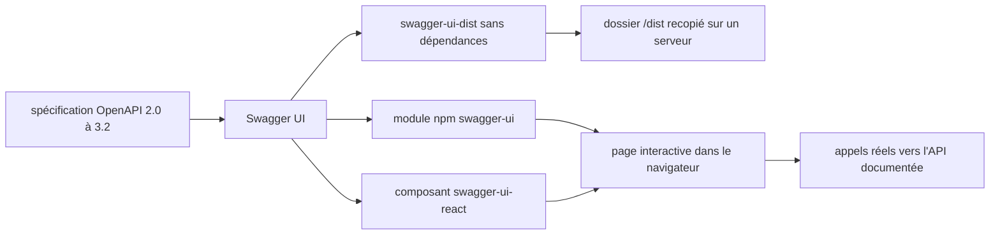

# swagger-api/swagger-ui

> **La doc d'API qu'on lit et qu'on essaie.** Rend une spécification OpenAPI navigable et appelable dans un navigateur.

## Le problème

Sans lui, une spécification OpenAPI reste un fichier JSON ou YAML que personne ne lit : l'équipe
back doit écrire à la main une page de documentation, et le consommateur de l'API n'a aucun
moyen d'essayer un appel avant d'avoir écrit du code client.

## Ce que ça fait vraiment

Le README l'annonce ainsi : la page est **générée automatiquement depuis la spécification
OpenAPI** (anciennement Swagger), et permet de visualiser les ressources de l'API et
d'interagir avec elles sans disposer de la logique d'implémentation. Le dépôt publie trois
modules npm distincts : `swagger-ui`, module classique pour les applications monopage capables
de résoudre leurs dépendances via Webpack ou Browserify ; `swagger-ui-dist`, sans dépendances,
pour servir l'UI depuis un projet côté serveur ; et `swagger-ui-react`, l'UI empaquetée en
composant React. Le README recommande explicitement `swagger-ui` plutôt que `swagger-ui-dist`
pour une application monopage, `swagger-ui-dist` étant nettement plus volumineux. Pour du
HTML/JS/CSS brut, il indique de télécharger la dernière release et de recopier le contenu du
dossier `/dist` sur son serveur. La documentation listée couvre l'installation, la
configuration, CORS, OAuth2, le deep linking et la détection de version, plus une API de
plugins, un layout personnalisé et une vue d'ensemble de la personnalisation.

## Comment c'est branché



Une seule entrée : le fichier de spécification. Trois sorties d'empaquetage selon la cible
(bundler, serveur, React), qui produisent la même page interactive, laquelle émet ensuite de
vrais appels vers l'API décrite. Le README ne documente pas les fichiers internes du dépôt,
ce schéma est déduit de la seule section « three different NPM modules ».

## Essayer

Le README ne donne pas de commande d'installation ni d'initialisation — il renvoie vers
`docs/usage/installation.md`. Les seules commandes qu'il contient concernent les tests
end-to-end, sous Cypress :

```sh
npm run cy:ci
npm run cy:dev
npm run cy:start
# in a second terminal:
npm run cy:run -- --spec "test/e2e-cypress/e2e/features/deep-linking.cy.js"
```

Pour désactiver la collecte d'analytics, le README donne deux voies : `scarfSettings.enabled`
à `false` dans le `package.json`, ou la variable d'environnement `SCARF_ANALYTICS=false` dans
l'environnement qui installe les paquets npm.

## Coût et pièges

Rien à payer, licence Apache-2.0 avec un fichier NOTICE explicite portant des mentions légales
supplémentaires. Le vrai piège est la **télémétrie** : le README indique que SwaggerUI utilise
Scarf pour collecter des analytics d'installation anonymisés, actifs à l'installation, avec
opt-out à faire soi-même. Second piège, la compatibilité : la table du README associe chaque
version de l'UI à une liste précise de révisions d'OpenAPI, et une spécification 3.1 ou 3.2 ne
s'affichera pas sur une vieille 4.x. Troisième, le poids : `swagger-ui-dist` est signalé comme
nettement plus gros. CORS et OAuth2 ont chacun leur page de documentation, ce qui signale une
configuration à prévoir. Les tests Cypress exigent que rien d'autre n'écoute sur les mêmes ports.

## Ce que ce n'est pas

Ce n'est pas un éditeur de spécification : on visualise et on essaie, on ne rédige pas. Ce
n'est pas un générateur de code client ni un serveur d'API. Le README liste des manques assumés
depuis la 3.x : seule une partie des paramètres autrefois supportés est disponible, l'éditeur
de formulaire JSON n'est pas implémenté, le support de `collectionFormat` est partiel, la
localisation n'est pas implémentée, et les chemins relatifs vers des fichiers externes non plus.
Le support navigateur se limite aux dernières versions de Chrome, Safari, Firefox et Edge.

## Alternatives

`swagger-api/swagger-editor` pour écrire et valider la spécification plutôt que la consulter —
les deux sont complémentaires, pas concurrents. `getkin/kin-openapi` si le besoin est de
manipuler ou valider de l'OpenAPI en Go côté programme, sans interface. `fastapi/fastapi` si
l'API est à écrire en Python : elle embarque déjà une interface de ce type, inutile d'en monter
une. Ces voisins sont fournis par le catalogue, seul swagger-editor relève du même écosystème.

## Pour toi

Dès qu'un service de modèle ou une API d'inférence expose une spec OpenAPI, c'est la manière la
moins coûteuse de la rendre essayable par les équipes qui la consommeront. À adopter, en pensant
à couper Scarf dans les environnements de build.
