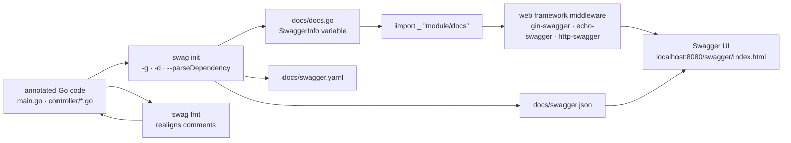

# swaggo/swag

> **Swagger 2.0 spec generator for Go APIs, driven by annotations written as code comments.**

## The problem

Without it, a Go API's documentation lives in a hand-written `swagger.yaml` sitting next to the
handlers and never in sync with them: rename a struct field, add an error code, and the
published spec describes an API that no longer exists. Keeping it honest means maintaining two
truths, only one of which the compiler checks.

## What it actually does

Swag parses a project's Go files, reads the annotated comments (`@Summary`, `@Param`,
`@Success`, `@Router`, `@title`, `@securityDefinitions…`) and writes three files into `docs/`:
`docs.go`, `swagger.json` and `swagger.yaml`. Which ones are produced is set by
`--outputTypes`.

Types are resolved from the code itself: structs referenced as `{object} model.Account`,
slices as `{array}`, Go generics (`web.GenericNestedResponse[types.Post]`), type overrides via
the `swaggertype` tag or a `.swaggo` file, field exclusion via `swaggerignore`. It can walk
internal packages (`--parseInternal`) and dependencies (`--parseDependency`, with a
`--pdl` level), to a configurable depth.

The generated `docs.go` exposes a `SwaggerInfo` variable, so title, description, version, host
and base path can still be set at startup. A second subcommand, `swag fmt`, realigns the
annotation comments the way `go fmt` realigns code.

What it does **not** do itself: serve the docs. Rendering comes from a companion package per
web framework — `gin-swagger`, `echo-swagger`, `http-swagger` (net/http, gorilla/mux, go-chi),
plus buffalo, fiber, hertz, atreugo and flamingo.

## How it is wired



No code-derived diagram exists for this repo: the graph above is reconstructed from the README
alone, following its "Getting started" section and the `example/celler` sample. The thing to
notice is the split between `swag` (left, offline, at build time) and the framework middleware
(right, at run time): two separate repositories, joined only by the import of `docs.go`.

## Trying it

```sh
go install github.com/swaggo/swag/cmd/swag@latest
```

```sh
docker run --rm -v $(pwd):/code ghcr.io/swaggo/swag:latest
```

```sh
swag init
```

```sh
swag init -g http/api.go
```

```sh
swag fmt
```

Flags the README offers for the awkward cases:

```shell
swag fmt -d ./ --exclude ./internal
```

```console
swag init -g http/api.go -td "[[,]]"
```

```bash
swag init --outputTypes go,yaml
swag init --parseDependency --parseInternal
```

On the application side, add `import _ "example-module-name/docs"`, then the middleware:
`r.GET("/swagger/*any", ginSwagger.WrapHandler(swaggerFiles.Handler))`.

## Cost and gotchas

- **No API key, no third-party service, no GPU**: the tool runs offline at generation time.
  The cost is build time, not a bill.
- **A Go toolchain for the `go install` route**: the README asks for Go 1.19 or newer to build
  from source. Otherwise take a pre-compiled binary from the releases page, or the
  `ghcr.io/swaggo/swag:latest` image.
- **`swag fmt` needs a standard doc comment** ahead of the annotations, since it indents them
  with tabs, which is only legal after one. The README spells this out and gives the correct
  shape.
- **Go template delimiters**: `{{` or `}}` inside an annotation or struct field will break
  generation; `-td "[[,]]"` changes them.
- **`--parseDependency` is expensive**: default parse depth is 100, hence
  `--parseDependencyLevel` to limit parsing to models only, or operations only.
- **Licence**: the catalogue records MIT, but the README never states it — its "License"
  section is a FOSSA badge, and the only licence named in plain words is the Creative Commons
  BY 3.0 covering the gopher image. Check the `LICENSE` file before internal use. That is the
  reason for the alert.
- **Swagger Extensions are unsupported**: the one unchecked box in the README's
  "Implementation Status" list.

## What it is not

- **It is not OpenAPI 3.** The README is explicit: Swagger **2.0**. If anything downstream
  (gateway, client generator, developer portal) requires OpenAPI 3.x, you convert afterwards —
  or you pick a different tool.
- **It is not a documentation server.** Swag writes files; the Swagger UI comes from a
  companion repo per framework that you install and wire yourself.
- **It is not contract-first.** The Go code stays the source of truth: you do not generate
  handlers from a spec, you generate a spec from handlers. The spec is therefore a reflection,
  never a guarantee — a mis-annotated handler yields wrong documentation and nothing fails.

## Alternatives

| | When to prefer it |
|---|---|
| **yvasiyarov/swagger** | Named in the README as the project swag was inspired by, whose usage it says it simplified while adding more web frameworks. Mostly of historical interest. |
| **getkin/kin-openapi** | Catalogue neighbour: a Go library for **OpenAPI 3**, driven from code (loading, validation, spec-based routing). Prefer it when you need OpenAPI 3 or a contract-first workflow; prefer swag to annotate an existing Go API without restructuring it. |
| **fastapi/fastapi** | Catalogue neighbour, useful only as a contrast outside Go: there the spec is derived from signatures and models rather than comments. Irrelevant if the service is already written in Go. |

The remaining neighbours (`hatchet-dev/hatchet`, `fastify/fastify`) are not comparable:
neither generates a specification from Go code.

## For you

Adopt it if you expose Go APIs — an inference service, a feature gateway, an MLOps back office:
it is the shortest path from an annotated handler to a Swagger UI that client teams can read,
and `swag init` drops into a Makefile or a CI step without ceremony. Temper that if your
toolchain is OpenAPI 3, or if your services are Python: the Swagger 2.0 lock-in will be paid
back in conversion work.
