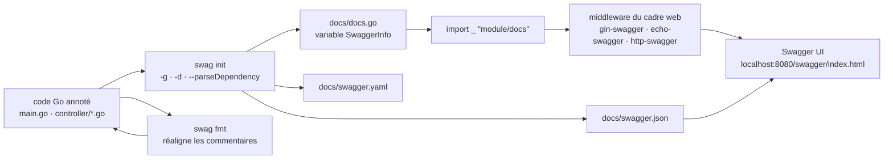

# swaggo/swag

> **Générateur de spécification Swagger 2.0 pour API Go, à partir de commentaires posés dans le code.**

## Le problème

Sans lui, la documentation d'une API Go vit dans un fichier `swagger.yaml` écrit à la main, à
côté des handlers et jamais à jour : on renomme un champ de struct, on ajoute un code d'erreur,
et la spécification publiée décrit une API qui n'existe plus. La maintenir demande de tenir
deux vérités parallèles, l'une compilée, l'autre pas.

## Ce que ça fait vraiment

Swag lit les fichiers Go d'un projet, analyse les commentaires annotés (`@Summary`, `@Param`,
`@Success`, `@Router`, `@title`, `@securityDefinitions…`) et produit trois fichiers dans
`docs/` : `docs.go`, `swagger.json`, `swagger.yaml`. Le choix des formats se règle par
`--outputTypes`.

Il résout les types depuis le code : structs référencées par `{object} model.Account`,
tableaux par `{array}`, types génériques Go (`web.GenericNestedResponse[types.Post]`),
surcharges de type via la balise `swaggertype` ou un fichier `.swaggo`, exclusions via
`swaggerignore`. Il sait descendre dans les paquets internes (`--parseInternal`) et dans les
dépendances (`--parseDependency`, avec un niveau `--pdl`), à une profondeur réglable.

`docs.go` expose une variable `SwaggerInfo` : titre, description, version, hôte et base path
restent modifiables au démarrage du programme. Une seconde sous-commande, `swag fmt`, réaligne
les commentaires d'annotation comme le ferait `go fmt`.

Ce qu'il ne fait **pas** lui-même : servir la documentation. L'affichage passe par un paquet
tiers de la même organisation, un par cadre web — `gin-swagger`, `echo-swagger`,
`http-swagger` (net/http, gorilla/mux, go-chi), plus buffalo, fiber, hertz, atreugo, flamingo.

## Comment c'est branché



Aucun diagramme tiré du code n'existe pour ce dépôt : ce schéma est reconstruit depuis le seul
README, d'après la section « Getting started » et l'exemple `example/celler`. Le point à
retenir est la coupure entre `swag` (à gauche, hors ligne, à la génération) et le middleware
du cadre web (à droite, à l'exécution) : deux dépôts distincts, reliés par l'import de
`docs.go`.

## Essayer

```sh
go install github.com/swaggo/swag/cmd/swag@latest
```

```sh
docker run --rm -v $(pwd):/code ghcr.io/swaggo/swag:latest
```

```sh
swag init
```

```sh
swag init -g http/api.go
```

```sh
swag fmt
```

Options citées par le README pour les cas qui coincent :

```shell
swag fmt -d ./ --exclude ./internal
```

```console
swag init -g http/api.go -td "[[,]]"
```

```bash
swag init --outputTypes go,yaml
swag init --parseDependency --parseInternal
```

Côté application, l'import à ajouter est `import _ "example-module-name/docs"`, puis le
middleware : `r.GET("/swagger/*any", ginSwagger.WrapHandler(swaggerFiles.Handler))`.

## Coût et pièges

- **Aucune clé d'API, aucun service tiers, aucun GPU** : l'outil tourne hors ligne à la
  génération. Le coût est du temps de compilation, pas de facture.
- **Chaîne Go requise pour la voie `go install`** : le README demande Go 1.19 ou plus récent
  pour construire depuis les sources. Sinon, binaire pré-compilé de la page des versions, ou
  image `ghcr.io/swaggo/swag:latest`.
- **`swag fmt` exige un commentaire de documentation standard** avant les annotations, sinon
  l'indentation par tabulations est refusée par le compilateur de commentaires. Le README le
  signale explicitement et donne l'exemple correct.
- **Délimiteurs de gabarit Go** : des `{{` ou `}}` dans une annotation ou un champ de struct
  font échouer la génération ; il faut alors `-td "[[,]]"`.
- **`--parseDependency` est coûteux** : profondeur par défaut 100, d'où le réglage
  `--parseDependencyLevel` pour ne parser que les modèles ou que les opérations.
- **Licence** : le catalogue relève MIT, mais le README ne l'écrit nulle part — sa section
  « License » ne contient qu'un badge FOSSA, et la seule licence nommée en toutes lettres est
  le Creative Commons BY 3.0 de l'image du gopher. À lever sur le fichier `LICENSE` avant
  usage interne. C'est la raison de l'alerte.
- **Extensions Swagger non couvertes** : c'est la seule case non cochée de la liste
  « Implementation Status » du README.

## Ce que ce n'est pas

- **Ce n'est pas OpenAPI 3.** Le README est sans ambiguïté : Swagger **2.0**. Si la chaîne
  d'outillage aval (passerelle, générateur de clients, portail) exige de l'OpenAPI 3.x, il
  faut convertir après coup — ou changer d'outil.
- **Ce n'est pas un serveur de documentation.** Swag écrit des fichiers ; l'interface
  Swagger UI vient d'un dépôt compagnon par cadre web, à installer et câbler soi-même.
- **Ce n'est pas du contract-first.** La vérité reste le code Go : on ne part pas d'une
  spécification pour générer des handlers, on part des handlers pour générer la spécification.
  La spécification n'est donc jamais une garantie, seulement un reflet — un handler mal annoté
  produit une documentation fausse que rien ne fait échouer.

## Alternatives

| | Quand le préférer |
|---|---|
| **yvasiyarov/swagger** | Cité par le README comme l'inspiration du projet, dont swag dit avoir simplifié l'usage et élargi le support des cadres web. Intérêt surtout historique. |
| **getkin/kin-openapi** | Voisin du catalogue : bibliothèque Go pour **OpenAPI 3**, manipulée par le code (lecture, validation, routage d'après la spec). À préférer dès qu'on veut de l'OpenAPI 3 ou une approche contract-first ; swag à préférer pour annoter une API Go existante sans la restructurer. |
| **fastapi/fastapi** | Voisin du catalogue, pertinent seulement comme point de comparaison hors Go : la spécification y est dérivée des signatures et des modèles, pas de commentaires. Sans objet si le service est déjà écrit en Go. |

Les autres voisins (`hatchet-dev/hatchet`, `fastify/fastify`) ne sont pas comparables : ni l'un
ni l'autre ne génère de spécification depuis du code Go.

## Pour toi

À adopter si tu exposes des API Go — un service d'inférence, une passerelle de features, un
back-office MLOps : c'est le chemin le plus court d'un handler annoté à un Swagger UI que les
équipes clientes peuvent lire, et `swag init` s'ajoute sans douleur à un Makefile ou à une
étape de CI. À relativiser en revanche si ta chaîne est en OpenAPI 3 ou si tes services sont en
Python : le verrou Swagger 2.0 se paiera en conversion.
