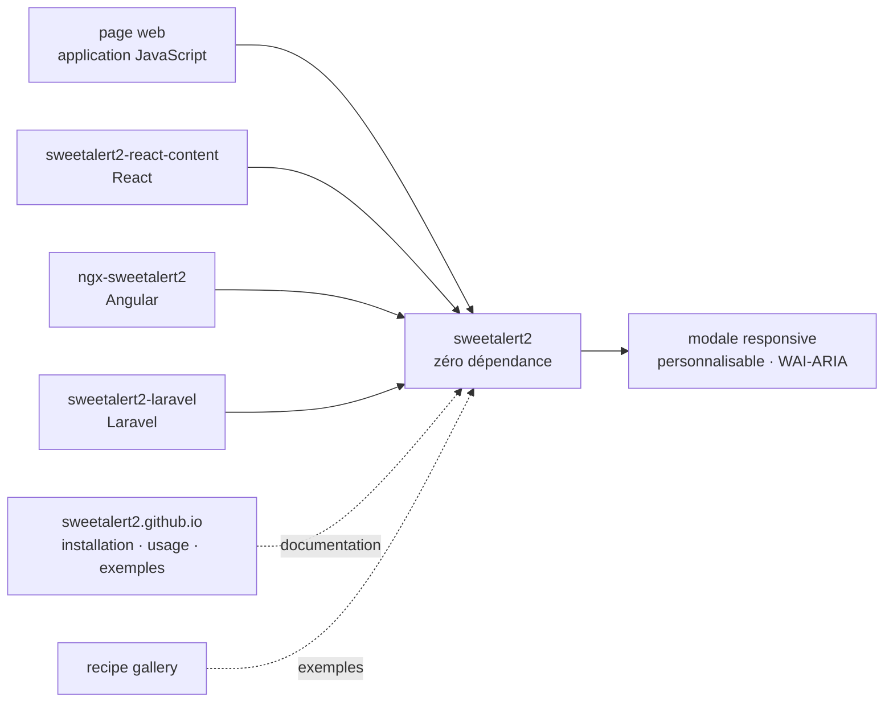

# sweetalert2/sweetalert2

> **A JavaScript library replacing the browser's native dialog boxes, aimed at front-end developers.**

## The problem

`alert()`, `confirm()` and `prompt()` come from the browser: you cannot style them, cannot put
anything beyond a line of text inside them, and cannot control their keyboard behaviour or how a
screen reader announces them. They also block the page's execution. Every project ends up
rewriting its own modal, and accessibility is rarely handled in the process.

## What it actually does

The README is mostly a sponsor page; the technical substance amounts to one sentence of
description and a row of links. What it claims: a replacement for JavaScript's popup boxes,
responsive, customizable, accessible (WAI-ARIA), and with **zero dependencies**.

Everything else — installation, usage, examples — is delegated to the `sweetalert2.github.io`
site, plus a separate recipe gallery. The README documents neither the API, nor the options, nor
a single function name: you have to leave the repository to learn how to use it.

Three official integrations are announced, each in its own repository:
`sweetalert2/sweetalert2-react-content` for React, `sweetalert2/ngx-sweetalert2` for Angular,
`sweetalert2/sweetalert2-laravel` for Laravel.

## How it is wired



No code-derived diagram exists for this repository: the graph above is reconstructed from the
README alone, and therefore names no source file — the README mentions none, apart from
`assets/swal2-logo.png` and `SPONSORS.md`. The three wrappers are separate repositories layered
on top of the library, not internal modules.

## Trying it

```text
No command is documented in the README: the "Installation" section is a link to
https://sweetalert2.github.io/#download, and so are "Usage" and "Examples". Nothing is
reconstructed here.
```

You therefore have to open the project website to get the install line and a first call example.

## Cost and traps

- **Free, no account, no key**: nothing to pay for, nothing to sign up to. The README announces
  neither a third-party service nor telemetry.
- **Zero dependencies** is the claim: it is the main verifiable argument in the README, and it
  makes a front-end build chain easier to audit.
- **The trap is documentation living outside the repository.** Everything goes through
  `sweetalert2.github.io`: if that site changes or goes away, the repository alone is not enough
  to learn the API. That is also why this note is short — there is little material to summarise.
- **The README is saturated with commercial content**: two sponsor blocks, including an "NSFW
  Sponsors" section with dozens of links, and an affiliate link to a web host. No effect on the
  code, but worth knowing before sharing the repository page in a professional setting.
- **Sponsorship contact goes through a personal address** (`sweetalert2@gmail.com`, "get in touch
  with me"), a sign of a project driven by a single person.

## What it is not

- **Not a UI framework**: the library only provides dialog boxes — no component set, no layout
  system, no state management.
- **Not a React or Angular component.** The README points to three separate repositories for
  those integrations: installing sweetalert2 alone in a React project does not give you the
  idiomatic version advertised.
- **Not a drop-in replacement for `alert()`**: it is a distinct API, which the README does not
  document. Migrating existing code means rewriting it, not swapping a function name.
- **"Accessible (WAI-ARIA)" is a README claim**, with no audit or standard cited: verify it
  yourself if accessibility is a contractual requirement.

## Alternatives

No comparable alternative in the catalogue. The lexical neighbours offered
(`lioensky/VCPToolBox`, `JanDeDobbeleer/oh-my-posh`, `microsoft/promptflow`,
`netease-youdao/EmotiVoice`) belong respectively to agent tooling, terminal prompt theming,
prompt orchestration and speech synthesis: none of them builds web interfaces, so the pairing is
an artefact of shared vocabulary. The only repositories named by the README
(`sweetalert2-react-content`, `ngx-sweetalert2`, `sweetalert2-laravel`) are integrations of the
same project, not competitors.

## For you

Little to do with a data / AI / MLOps chain: this is a front-end web brick, useful the day you
dress up an internal dashboard, a demo page or a home-made annotation tool and want a
keyboard-correct confirmation dialog without pulling in a UI framework. Worth keeping in reserve
on those terms, not as a structural dependency — and knowing its documentation lives outside the
repository.
