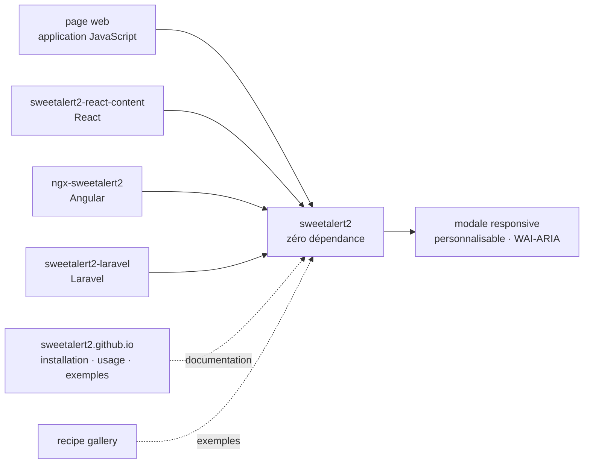

# sweetalert2/sweetalert2

> **Bibliothèque JavaScript qui remplace les boîtes de dialogue natives du navigateur, pour développeurs front.**

## Le problème

`alert()`, `confirm()` et `prompt()` sont fournis par le navigateur : on ne peut ni les mettre
en forme, ni y placer autre chose qu'une ligne de texte, ni contrôler leur comportement au
clavier ou leur restitution par un lecteur d'écran. Ils bloquent aussi le fil d'exécution de la
page. Chaque projet finit par réécrire sa propre modale, et la question de l'accessibilité y est
rarement traitée.

## Ce que ça fait vraiment

Le README est pour l'essentiel une page de sponsors ; la matière technique tient en une phrase
de présentation et une barre de liens. Ce qu'elle annonce : un remplacement des popups
JavaScript, responsive, personnalisable, accessible (WAI-ARIA), et **sans aucune dépendance**.

Tout le reste — installation, usage, exemples — est renvoyé vers le site
`sweetalert2.github.io`, avec une *recipe gallery* séparée. Le README ne documente ni l'API, ni
les options, ni le nom des fonctions : il faut sortir du dépôt pour savoir comment s'en servir.

Trois intégrations officielles sont annoncées, chacune dans son propre dépôt :
`sweetalert2/sweetalert2-react-content` pour React, `sweetalert2/ngx-sweetalert2` pour Angular,
`sweetalert2/sweetalert2-laravel` pour Laravel.

## Comment c'est branché



Aucun diagramme tiré du code n'existe pour ce dépôt : ce schéma est reconstruit depuis le seul
README, et ne nomme donc aucun fichier du dépôt — le README n'en cite pas un seul, hormis
`assets/swal2-logo.png` et `SPONSORS.md`. Les trois wrappers sont des dépôts distincts posés
au-dessus de la bibliothèque, pas des modules internes.

## Essayer

```text
Aucune commande n'est documentée dans le README : la section « Installation » est un lien vers
https://sweetalert2.github.io/#download, tout comme « Usage » et « Examples ». Rien n'est
reconstruit ici.
```

Il faut donc ouvrir le site du projet pour obtenir la ligne d'installation et le premier
exemple d'appel.

## Coût et pièges

- **Gratuit, sans compte, sans clé** : rien à payer, rien à créer. Le README n'annonce ni
  service tiers ni télémétrie.
- **Zéro dépendance** revendiqué : c'est le principal argument vérifiable du README, et il
  simplifie l'audit d'une chaîne de build front.
- **Le piège est la documentation hors dépôt.** Tout passe par `sweetalert2.github.io` : si le
  site tombe ou change, le dépôt seul ne suffit pas à apprendre l'API. C'est aussi ce qui rend
  cette fiche courte — il n'y a pas de matière à résumer.
- **Le README est saturé de contenus commerciaux** : deux blocs de sponsors, dont une section
  « NSFW Sponsors » de plusieurs dizaines de liens, et un lien d'affiliation vers un hébergeur.
  Sans effet sur le code, mais à savoir avant de partager la page du dépôt dans un contexte
  professionnel.
- **Le contact de sponsoring passe par une adresse personnelle** (`sweetalert2@gmail.com`,
  « get in touch with me »), indice d'un projet piloté par une seule personne.

## Ce que ce n'est pas

- **Ce n'est pas un framework d'interface** : la bibliothèque ne fournit que des boîtes de
  dialogue, pas un jeu de composants, pas de système de mise en page, pas de gestion d'état.
- **Ce n'est pas un composant React ou Angular.** Le README renvoie vers trois dépôts séparés
  pour ces intégrations : installer sweetalert2 seul dans un projet React ne donne pas la
  version idiomatique annoncée.
- **Ce n'est pas un remplacement transparent de `alert()`** : c'est une API distincte, que le
  README ne documente pas. Migrer du code existant demande de le réécrire, pas de substituer un
  nom de fonction.
- **Accessible (WAI-ARIA) est une affirmation du README**, sans audit ni référentiel cité : à
  vérifier soi-même si l'accessibilité est une exigence contractuelle.

## Alternatives

Aucune alternative comparable dans le catalogue. Les voisins proposés par le lexique
(`lioensky/VCPToolBox`, `JanDeDobbeleer/oh-my-posh`, `microsoft/promptflow`,
`netease-youdao/EmotiVoice`) relèvent respectivement de l'outillage d'agents, du thème de
terminal, de l'orchestration de prompts et de la synthèse vocale : aucun ne fait d'interface
web, le rapprochement est un artefact de vocabulaire. Les seuls dépôts nommés par le README
(`sweetalert2-react-content`, `ngx-sweetalert2`, `sweetalert2-laravel`) sont des intégrations du
même projet, pas des concurrents.

## Pour toi

Peu de rapport avec une chaîne data / IA / MLOps : c'est une brique de front web, utile le jour
où l'on habille un tableau de bord interne, une page de démonstration ou un outil d'annotation
maison et où l'on veut une confirmation correcte au clavier sans embarquer un framework
d'interface. À garder en réserve à ce titre, sans en faire une dépendance structurante — et en
sachant que la documentation vit hors du dépôt.
