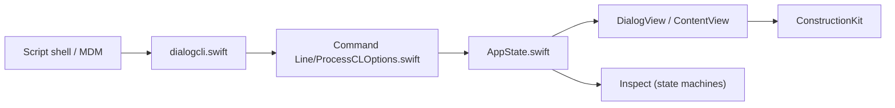

# swiftDialog/swiftDialog

> Utilitaire macOS 15+ pour administrateurs : affiche des boîtes de dialogue personnalisées pilotées par scripts.

## Le problème
Les scripts d'administration macOS ont besoin d'afficher des messages, formulaires et progressions propres, sans écrire une app Swift.

## Ce que ça fait vraiment
Un exécutable en ligne de commande (`dialogcli`) analyse des options et lance une interface SwiftUI : titre, message Markdown, icône, boutons, champs, listes, minuteurs. Un « Construction Kit » rend des formulaires déclaratifs, et « Inspect » gère des parcours de déploiement et de conformité. Un utilitaire de notifications est livré à part.

## Comment c'est branché

## Essayer
Le README ne donne pas de commande : la documentation détaillée est sur swiftdialog.app.

## Coût et pièges
Gratuit. Il exige macOS 15 ou plus ; pour macOS 14 et avant, le README renvoie à la v2.5.6. Le README est court (documentation externe).

## Ce que ce n'est pas
Ce n'est pas une bibliothèque Swift à intégrer : c'est un outil piloté depuis la ligne de commande, propre à macOS.

## Alternatives
Le README ne cite aucune alternative.

## Pour toi
À ignorer : outil d'administration de parc Mac, sans rapport avec le travail data/IA/MLOps.

