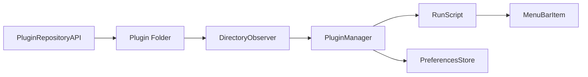

# swiftbar/SwiftBar

> Appli macOS qui affiche dans la barre de menus la sortie de tes scripts.

## Le problème
Voir en un coup d'œil une information (statut, métrique) sans ouvrir de fenêtre, avec un simple script.

## Ce que ça fait vraiment
`PluginManager` observe un dossier de plugins (`DirectoryObserver`), exécute chaque script (`RunScript`) selon l'intervalle du nom de fichier ou une expression cron, et parse la sortie (en-tête, `---`, paramètres) en `MenuBarItem`. Compatible avec les plugins BitBar/xbar. Types : standard, Shortcuts, éphémère, streamable.

## Comment c'est branché


## Essayer
```bash
brew install swiftbar
echo "This is Menu Title"
```
(le second exemple est un plugin minimal, à enregistrer par exemple sous `date.1m.sh`).

## Coût et pièges
Gratuit. Nécessite macOS 12 ou plus. Les plugins sont des scripts exécutés avec tes droits : n'installe que ceux de confiance.

## Ce que ce n'est pas
Ce n'est pas un outil de supervision : il affiche ce que renvoient les scripts.

## Alternatives
- xbar/BitBar : même API de plugins, dont SwiftBar reprend le format.

## Pour toi
À ignorer : gadget de poste Mac ; tu peux l'utiliser pour suivre un job d'entraînement, mais ce n'est pas un outil MLOps.

