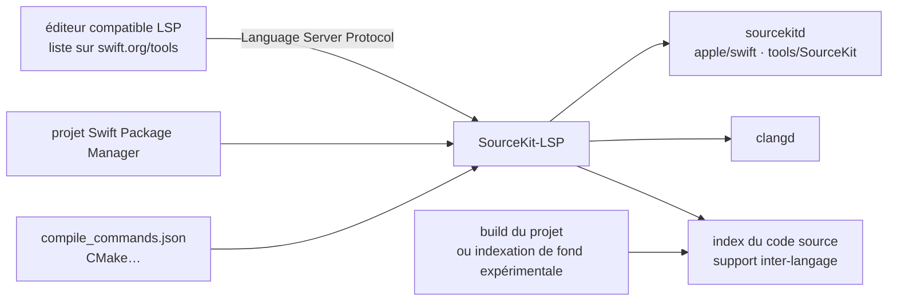

# swiftlang/sourcekit-lsp

> **The official language server for Swift and C-based languages, shipped inside the toolchain.**

## The problem

Without a language server, an editor that is not Xcode knows nothing about Swift code: no
completion, no jump-to-definition, no index. And when a project mixes Swift with C, C++ or
Objective-C, each side historically has its own tooling, with no bridge between them.

## What it actually does

SourceKit-LSP implements the Language Server Protocol for Swift and C-based languages. It gives
any LSP-capable editor the editor functionality the README names explicitly: code completion
and jump-to-definition.

It does not reimplement the analysis. It builds on `sourcekitd` (the Swift side, from the
apple/swift repository) and on `clangd` (the C side), and layers on top a source code index
plus cross-language support — that is, navigating from a Swift file to a C declaration and back.

On the project side it recognises two shapes: Swift Package Manager packages, and any project
that produces a `compile_commands.json`, CMake for instance.

One point is stated prominently in the README: it does **not** update its global index in the
background, and does **not** build Swift modules in the background. Background indexing exists
but is experimental and must be enabled explicitly.

## How it is wired



No code-derived diagram exists for this repository: the graph above is reconstructed from the
README alone. The only file names the README gives are documentation ones
(`Documentation/Enable Experimental Background Indexing.md`,
`Documentation/Using SourceKit-LSP with Embedded Projects.md`, `CONTRIBUTING.md`); the internal
code structure is not documented here.

## Trying it

```
No command is documented in the README.
```

The README gives no build line, no install command and no way to invoke the server. It points
to three places instead: the Swift toolchains on `swift.org/install`, which already include
SourceKit-LSP; Xcode, which bundles it; and `swift.org/tools` for the list of LSP-capable
editors and their set-up guides. The wiring happens on the editor side, not in this repository.

## Cost and traps

- **Free, and already present.** Nothing to install if a Swift toolchain or Xcode is there: the
  binary is bundled. The real prerequisite is therefore that toolchain.
- **The index is cold until the project has been built.** The README flags this in a callout:
  without a recent build, a lot of cross-module or global functionality is limited. The
  documented workaround is to build the project, or to turn on background indexing — which the
  README explicitly calls experimental.
- **Embedded projects**: if the SwiftPM project needs extra arguments passed to `swift build`,
  those arguments must be taught to SourceKit-LSP, via a procedure deferred to a separate
  document. The README describes this as a common case for embedded work.
- **Thin README**: no commands, no compatibility matrix, no version. Everything is deferred to
  the `Documentation` folder and to swift.org. Hence the "insufficient material" flag — it is
  about the write-up, not about the project.

## What it is not

- **Not an editor, and not an editor extension.** This is the server side; the client side is
  the editor's job, and the editor is what you configure.
- **Not a compiler and not a build system.** It reads a SwiftPM project or a
  `compile_commands.json` produced elsewhere; it does not build Swift modules in the background,
  as the README states outright.
- **Not a homegrown analysis engine.** The semantic work is done by `sourcekitd` and `clangd`;
  SourceKit-LSP orchestrates them and adds the index and the cross-language link.
- **Not an always-fresh index.** Continuous indexing stays experimental: a stale index is not a
  bug, it is the default behaviour.

## Alternatives

No comparable alternative in the catalogue: the batch line proposes no neighbours for this
repository, and the README names no competing project. The two repositories it does cite,
`sourcekitd` (inside apple/swift) and `clangd`, are not alternatives but the bricks
SourceKit-LSP is built on — using `clangd` alone would cover C without Swift.

## For you

Of no direct interest to a data / AI / MLOps profile, with one exception: Swift somewhere in the
chain, typically Core ML code or Apple embedded work edited outside Xcode. In that case this is
the only official path, free and already installed — and the one thing to remember is that the
project must be built for global navigation to work. Otherwise, move on.
