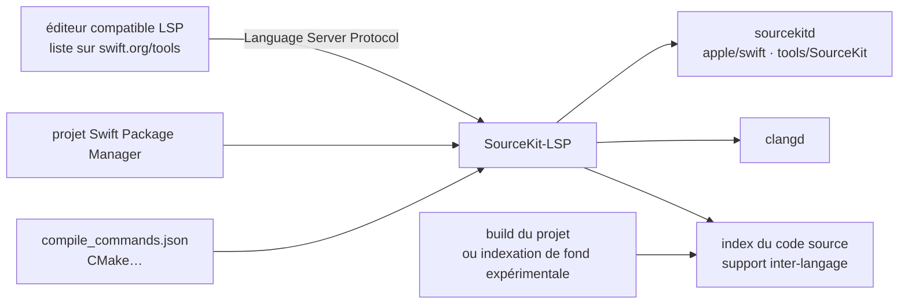

# swiftlang/sourcekit-lsp

> **Le serveur de langage officiel pour Swift et les langages à base C, livré avec la chaîne d'outils.**

## Le problème

Sans serveur de langage, un éditeur qui n'est pas Xcode ne sait rien du code Swift : pas de
complétion, pas de saut vers la définition, pas d'index. Et quand un projet mêle Swift et
C/C++/Objective-C, chaque côté a historiquement son propre outillage, sans passerelle de l'un
à l'autre.

## Ce que ça fait vraiment

SourceKit-LSP implémente le Language Server Protocol pour Swift et les langages à base de C.
Il fournit à tout éditeur compatible LSP les fonctions d'édition intelligente que le README
cite nommément : complétion de code et saut vers la définition.

Il ne réimplémente pas l'analyse : il s'appuie sur `sourcekitd` (côté Swift, issu du dépôt
apple/swift) et sur `clangd` (côté C), et expose par-dessus un index du code source ainsi
qu'un support inter-langage — c'est-à-dire la navigation d'un fichier Swift vers une
déclaration C et réciproquement.

Côté projets, il reconnaît deux formes : les paquets Swift Package Manager, et tout projet
qui produit un `compile_commands.json`, CMake par exemple.

Un point est écrit en majeur dans le README : il **ne met pas à jour son index global en
arrière-plan** et **ne construit pas les modules Swift en arrière-plan**. L'indexation en
tâche de fond existe mais reste expérimentale, à activer explicitement.

## Comment c'est branché



Aucun diagramme tiré du code n'existe pour ce dépôt : ce schéma est reconstruit depuis le seul
README. Les seuls noms de fichiers que le README donne sont ceux de la documentation
(`Documentation/Enable Experimental Background Indexing.md`,
`Documentation/Using SourceKit-LSP with Embedded Projects.md`, `CONTRIBUTING.md`) ; la
structure interne du code n'est pas documentée ici.

## Essayer

```
Aucune commande n'est documentée dans le README.
```

Le README ne donne ni ligne de compilation, ni commande d'installation, ni invocation du
serveur. Il renvoie à trois endroits : les chaînes d'outils Swift sur `swift.org/install`, où
SourceKit-LSP est déjà inclus ; Xcode, avec lequel il est livré ; et `swift.org/tools` pour la
liste des éditeurs compatibles LSP et leurs guides de configuration. Le branchement se fait
donc du côté de l'éditeur, pas du dépôt.

## Coût et pièges

- **Gratuit, et déjà là.** Rien à installer si une chaîne d'outils Swift ou Xcode est présente :
  le binaire y est inclus. Le vrai prérequis, non listable ici, est donc cette chaîne d'outils.
- **L'index est froid tant que le projet n'a pas été construit.** Le README le signale en
  encadré : sans build récent, « une bonne partie des fonctionnalités inter-modules ou globales
  est limitée ». La parade documentée est de construire le projet, ou d'activer l'indexation de
  fond — explicitement qualifiée d'expérimentale.
- **Projets embarqués** : si le projet SwiftPM exige des arguments supplémentaires passés à
  `swift build`, il faut les déclarer à SourceKit-LSP, procédure renvoyée à un document à part.
  Cas signalé comme fréquent pour l'embarqué.
- **README pauvre** : pas de commande, pas de matrice de compatibilité, pas de version. Tout est
  déporté vers le dossier `Documentation` et vers swift.org. D'où l'alerte « matière
  insuffisante » — elle porte sur la fiche, pas sur le projet.

## Ce que ce n'est pas

- **Ce n'est pas un éditeur ni une extension d'éditeur.** C'est le serveur ; la partie cliente
  est à la charge de l'éditeur, et c'est lui qu'il faut configurer.
- **Ce n'est pas un compilateur ni un système de build.** Il lit un projet SwiftPM ou un
  `compile_commands.json` produit par ailleurs ; il ne construit pas les modules Swift en tâche
  de fond, le README l'écrit noir sur blanc.
- **Ce n'est pas un moteur d'analyse maison.** Le travail sémantique est fait par `sourcekitd`
  et `clangd` ; SourceKit-LSP les orchestre et ajoute l'index et le lien inter-langage.
- **Ce n'est pas un index toujours à jour.** L'indexation continue reste expérimentale : un
  index périmé n'est pas un bug, c'est le comportement par défaut.

## Alternatives

Aucune alternative comparable dans le catalogue : la ligne du lot ne propose aucun voisin pour
ce dépôt, et le README ne nomme aucun projet concurrent. Les deux dépôts qu'il cite, `sourcekitd`
(dans apple/swift) et `clangd`, ne sont pas des alternatives mais les briques sur lesquelles
SourceKit-LSP est construit — utiliser `clangd` seul couvrirait le C sans le Swift.

## Pour toi

Sans intérêt direct pour un profil data / IA / MLOps, sauf dans un cas : du Swift dans la
chaîne, typiquement du code Core ML ou de l'embarqué Apple édité ailleurs que dans Xcode. Alors
c'est le seul chemin officiel, gratuit et déjà installé — et la seule chose à retenir est qu'il
faut construire le projet pour que la navigation globale fonctionne. Sinon, passer son chemin.
