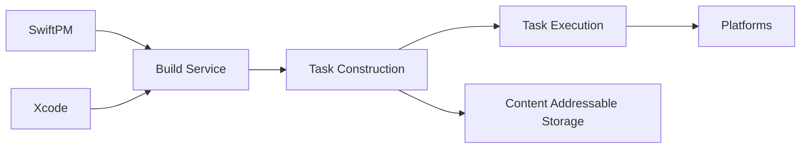

# swiftlang/swift-build

> Système de build haut niveau basé sur llbuild, utilisé par SwiftPM, Xcode et Swift Playground.

## Le problème
Construire des projets Swift multiplateformes exige un moteur de build unique partagé par les outils Apple et open source.

## Ce que ça fait vraiment
Un service de build avec construction de tâches (`SWBTaskConstruction`), exécution, modèle de projet, macros, stockage adressable par contenu et support de plateformes Apple, Android, Windows, QNX et Unix. Il est par défaut dans SwiftPM des snapshots nocturnes ; activable dans Swift 6.2 et 6.3 via `--build-system swiftbuild`.

## Comment c'est branché


## Essayer
```bash
swift package --disable-sandbox launch-xcode
swift package --disable-sandbox run-xcodebuild
swift test
docc preview SwiftBuild.docc
```

## Coût et pièges
Gratuit. Les workflows Xcode exigent la dernière version d'Xcode. Le débogage passe par l'attachement à `SWBBuildServiceBundle`.

## Ce que ce n'est pas
Pas un outil à installer seul : il sert de moteur derrière SwiftPM et Xcode.

## Alternatives
Aucune alternative nommée dans le README.

## Pour toi
À ignorer : outillage de compilation Swift, sans intérêt pour un profil data, IA ou MLOps.

