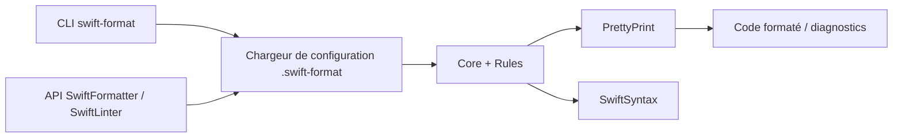

# swiftlang/swift-format

> Formateur et linter de code Swift, en ligne de commande ou en dépendance de paquet Swift.

## Le problème
Sans formateur commun, chaque équipe Swift débat du style et relit des diffs de mise en forme.

## Ce que ça fait vraiment
Trois sous-commandes : `format` (par défaut, avec `-i` pour écrire sur place sans sauvegarde), `lint` (`-s` pour échouer en cas d'avertissement) et `dump-configuration`. La configuration est un fichier JSON `.swift-format` cherché dans le dossier puis ses parents. Il s'appuie sur SwiftSyntax et expose `SwiftFormatter` et `SwiftLinter` pour l'intégrer à d'autres outils. Fourni dans la toolchain Swift 6.

## Comment c'est branché


## Essayer
```bash
brew install swift-format
swift-format lint [OPTIONS...] [FILES...]
swift-format dump-configuration
swift build -c release
swift test --parallel
```

## Coût et pièges
Gratuit. Le formatage `-i` écrase les fichiers sans copie. Les versions doivent correspondre à la toolchain pour les anciennes versions (avant Swift 5.8).

## Ce que ce n'est pas
Le README précise qu'aucun guide de style Swift par défaut n'est proposé : le style appliqué n'est qu'une possibilité. Ce n'est pas un outil multilangage.

## Alternatives
Aucune alternative nommée dans le README.

## Pour toi
À ignorer pour un profil data/IA/MLOps : il ne sert que si tu écris du Swift.

