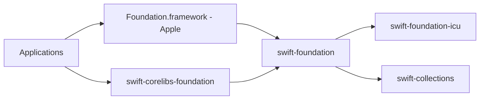

# swiftlang/swift-foundation

> Implémentation partagée des types de base de Foundation en Swift, pour les équipes qui développent Swift ou ses plateformes.

## Le problème
Foundation (URL, Data, Calendar…) existait en versions différentes selon les plateformes, avec des comportements divergents.

## Ce que ça fait vraiment
`swift-foundation` fournit les modules `FoundationEssentials` et `FoundationInternationalization` (URL, Data, JSONDecoder, Locale, Calendar…), utilisés sur toutes les plateformes. Sur Apple, le framework Foundation intègre ce code ; ailleurs il est livré avec la toolchain et réexporté par swift-corelibs-foundation. Dépend de swift-collections, swift-syntax et d'un wrapper ICU (swift-foundation-icu). Des macros (prédicats) sont incluses.

## Comment c'est branché

## Essayer
Le README ne fournit aucune commande précise : il renvoie au guide « Foundation Build Process » et précise qu'il faut une toolchain Swift nightly correspondante. Importer sinon `FoundationEssentials` ou `FoundationInternationalization`.

## Coût et pièges
Gratuit. Le paquet est destiné au développement de Foundation lui-même, pas comme dépendance d'un projet livré : utiliser la copie fournie par la toolchain ou l'OS.

## Ce que ce n'est pas
Ce n'est pas une bibliothèque à ajouter à ses dépendances. Il ne remplace pas la compatibilité Objective-C, prise en charge « au mieux » par corelibs.

## Alternatives
swift-corelibs-foundation (nommé dans le README) pour l'API historique sur plateformes non-Apple.

## Pour toi
À ignorer : infrastructure du langage Swift, sans intérêt direct pour un profil data, IA ou MLOps.

