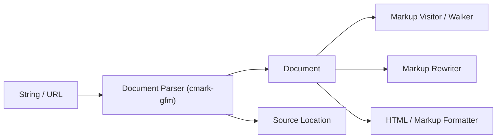

# swiftlang/swift-markdown

> Paquet Swift pour analyser, construire et transformer des documents Markdown, pour développeurs Swift.

## Le problème
Manipuler du Markdown en Swift sans arbre typé oblige à bricoler des expressions régulières.

## Ce que ça fait vraiment
Le parseur repose sur cmark-gfm. Il produit un arbre immuable de types valeur, avec copie à l'écriture et sûr pour les threads. Visiteurs, walkers et rewriters parcourent ou modifient l'arbre ; des formateurs sortent du HTML ou du Markdown. Une extension gère les block directives.

## Comment c'est branché


## Essayer
```bash
# Package.swift
# .package(url: "https://github.com/swiftlang/swift-markdown.git", branch: "main"),
# .product(name: "Markdown", package: "swift-markdown")
```
Puis en Swift : `let document = Document(parsing: source)`.

## Coût et pièges
Gratuit. Le README le référence par la branche `main`, sans version fixée. Le dialecte peut évoluer.

## Ce que ce n'est pas
Pas un moteur de rendu complet. Pas de CLI dans le README.

## Alternatives
Aucune alternative nommée dans le README.

## Pour toi
À ignorer : bibliothèque Swift sans rapport avec ton travail data/IA.

