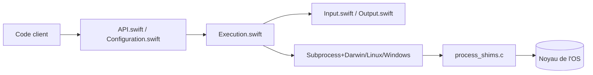

# swiftlang/swift-subprocess

> Paquet Swift multiplateforme pour lancer des sous-processus avec la concurrence Swift, pour développeurs Swift.

## Le problème
Lancer un processus enfant en Swift asynchrone, avec flux d'entrée/sortie, annulation propre et options par plateforme, est laborieux avec `Process`.

## Ce que ça fait vraiment
Expose `run(...)` : collecte de la sortie (`.string(limit:)`, `.bytes`) ou flux via une fermeture (`.sequence`), écriture sur l'entrée standard, environnement et répertoire de travail configurables, séquence d'arrêt gracieux à l'annulation (SIGTERM puis SIGKILL). `PlatformOptions` couvre Unix, macOS et Windows. Le code passe par des shims C (`posix_spawn`, `CreateProcess`).

## Comment c'est branché


## Essayer
```bash
swift package --disable-sandbox preview-documentation --target Subprocess
```
Ajouter la dépendance dans `Package.swift` : `.package(url: "https://github.com/swiftlang/swift-subprocess.git", .upToNextMinor(from: "0.4.0"))`.

## Coût et pièges
Gratuit. Les versions récentes (0.5.x, 1.0.x) exigent Swift 6.2 et Xcode 26. Les valeurs `Execution` ne doivent pas sortir de la fermeture.

## Ce que ce n'est pas
Ce n'est pas un outil en ligne de commande, et il n'existe pas de version pour un autre langage.

## Alternatives
Le README ne cite pas d'alternative (il se positionne face à `Process` implicitement).

## Pour toi
À ignorer : bibliothèque Swift bas niveau, utile seulement si tu écris du Swift.

