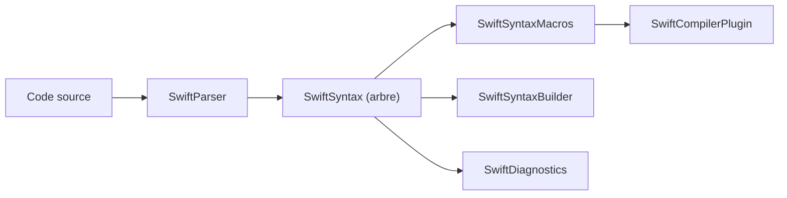

# swiftlang/swift-syntax

> Bibliothèques Swift qui manipulent l'arbre syntaxique du code source, socle du système de macros.

## Le problème
Analyser, construire et transformer du code Swift, notamment écrire des macros, exige un arbre syntaxique fidèle au source.

## Ce que ça fait vraiment
Fournit SwiftSyntax (arbre), SwiftParser, SwiftOperators, SwiftDiagnostics, SwiftSyntaxBuilder, SwiftSyntaxMacros, SwiftBasicFormat, SwiftCompilerPlugin, SwiftIDEUtils. Les versions suivent celles du langage (509 pour Swift 5.9). Configuration Bazel expérimentale.

## Comment c'est branché


## Essayer
```swift
dependencies: [
  .package(url: "https://github.com/swiftlang/swift-syntax.git", from: "<#latest swift-syntax tag#>"),
],
```

## Coût et pièges
Gratuit. Le temps de compilation initial est long ; les cibles `_opt` (Bazel) forcent les optimisations. Le numéro de version doit correspondre à la chaîne d'outils Swift.

## Ce que ce n'est pas
Pas un formateur ni un linter fini : c'est une brique pour bâtir de tels outils. Bazel : configuration expérimentale.

## Alternatives
- swift-ast-explorer.com : pour explorer l'arbre de manière interactive.

## Pour toi
À ignorer : bibliothèque de tooling Swift, sans lien avec les métiers data/IA/MLOps.

