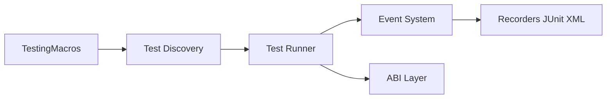

# swiftlang/swift-testing

> Framework de tests Swift à macros (`@Test`, `#expect`), livré avec Swift 6 et Xcode 16.

## Le problème
XCTest est verbeux et ses assertions dénaturent l'information sur l'échec.

## Ce que ça fait vraiment
`@Test` déclare un test ; `#expect` capture les valeurs évaluées pour expliquer l'échec ; `#require` interrompt. Traits (conditions, limites de temps), tags, hiérarchie de suites, tests paramétrés, exécution parallèle par défaut et intégration à Swift Concurrency. Coexiste avec XCTest.

## Comment c'est branché


## Essayer
Aucune commande d'installation : le framework est inclus dans le toolchain Swift 6 et Xcode 16.
```swift
@Test func helloWorld() {
  let greeting = "Hello, world!"
  #expect(greeting == "Hello")
}
```

## Coût et pièges
Gratuit. Compiler depuis les sources exige un toolchain de développement récent de la branche main.

## Ce que ce n'est pas
Pas un outil de test pour Python ou autre langage. Ne remplace pas XCTest pour les tests d'interface.

## Alternatives
Le README cite XCTest, avec lequel il fonctionne côte à côte.

## Pour toi
À ignorer : outil de test Swift, hors de ton périmètre data, IA, MLOps.

