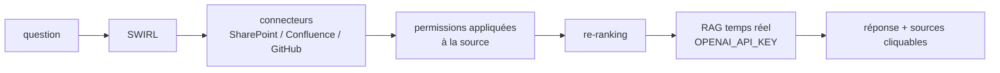

# swirlai/swirl-search

> Recherche fédérée et RAG sur tes applications, sans base vectorielle ni copie des données.

## Le problème
La plupart des « recherches IA » exigent de copier tout dans une base vectorielle, puis de gouverner
cette copie pour toujours : ETL, duplication, second périmètre à sécuriser et auditer.
Les permissions de la copie divergent de celles de la source.

## Ce que ça fait vraiment
Interroge les sources en direct avec les permissions de l'utilisateur, re-classe les résultats,
et génère optionnellement une réponse citée avec le LLM de ton choix.
Pas de base vectorielle, pas de pipeline ETL, pas de second exemplaire à gouverner.
Livré prêt à chercher sur Arxiv, Europe PMC et Google News ; connecteurs extensibles via des objets
Connector. Cas d'usage cités : base de connaissances SharePoint/Confluence/Drive, assistants support,
assistants développeur sur GitHub, Jira et documentation.

## Comment c'est branché


## Essayer
```bash
curl https://raw.githubusercontent.com/swirlai/swirl-search/main/docker-compose.yaml -o docker-compose.yaml
export OPENAI_API_KEY='<your-OpenAI-API-key>'
docker-compose pull && docker-compose up
```

## Coût et pièges
Ce dépôt est SWIRL Community, Apache-2.0, auto-hébergeable. SWIRL Enterprise ajoute un reranker
à trois passes, des réponses canoniques, un serveur MCP pour agents et du support payant.
La version Docker ne conserve ni données ni configuration à l'arrêt : installation persistante à part.
Identifiants par défaut `admin` / `password` à changer. Clé OpenAI à ta charge pour le RAG.

## Ce que ce n'est pas
Ce n'est pas une base de connaissances : rien n'est stocké, donc rien n'est disponible hors ligne.
Ce n'est pas la version complète : le serveur MCP et le reranker avancé sont côté Enterprise.
La latence dépend des API interrogées, pas d'un index local.

## Alternatives
SWIRL Enterprise, pour le reranker à trois passes et le serveur MCP.

## Pour toi
L'angle « pas de copie des données » est le bon argument en contexte contraint : à garder en tête.
