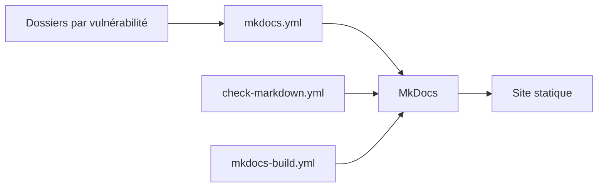

# swisskyrepo/PayloadsAllTheThings

> Recueil de référence, par type de vulnérabilité, pour les testeurs d'intrusion web.

## Le problème
Les pentesteurs et chercheurs en sécurité perdent du temps à retrouver des techniques éparses. Ce dépôt les range par catégorie de vulnérabilité.

## Ce que ça fait vraiment
- Un dossier par type de vulnérabilité (fuites de clés d'API, injection SQL, XSS…).
- Chaque dossier : un README de description, des jeux de fichiers pour Burp Intruder, des images, des fichiers annexes.
- Un gabarit `_template_vuln` pour ajouter un chapitre.
- Le contenu est publié en site statique par MkDocs et validé par GitHub Actions.

## Comment c'est branché

## Essayer
Aucune commande documentée : le dépôt se consulte en lecture, ou via la version web alternative citée dans le README.

## Coût et pièges
Gratuit. Le contenu est à double usage : à n'employer que sur des systèmes dont on a l'autorisation écrite de tester la sécurité.

## Ce que ce n'est pas
Ce n'est pas un logiciel exécutable ni un scanner : c'est de la documentation. Elle ne remplace pas une méthodologie de test ni un cadre juridique.

## Alternatives
- InternalAllTheThings : Active Directory et pentest interne.
- HardwareAllTheThings : pentest matériel et IoT.

## Pour toi
À surveiller : utile si tu sécurises des API ou des services de modèles, mais c'est une référence de sécurité offensive, pas un outil de ton quotidien data / MLOps.

