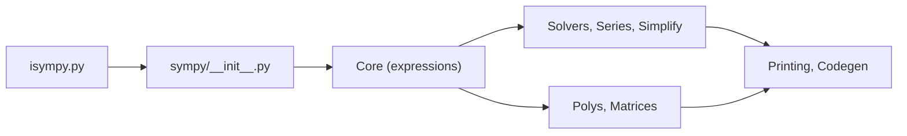

# sympy/sympy

> Bibliothèque Python de calcul symbolique : algèbre, calcul différentiel, équations, matrices, génération de code.

## Le problème
Manipuler des expressions mathématiques exactes (dérivées, séries, résolutions) au lieu d'approximations numériques, ou les convertir en code exécutable.

## Ce que ça fait vraiment
Un noyau `core` définit l'arbre d'expressions ; autour, des sous-paquets : `solvers`, `simplify`, `series`, `polys`, `matrices`, `tensor`, `physics`, `stats`, `ntheory`. Des passerelles convertissent : `parsing` (LaTeX, C, Fortran, Mathematica…), `printing` (LaTeX, C, Fortran, Julia…), `lambdify` vers NumPy/SciPy. Python pur ; `mpmath` en dépendance, NumPy/SciPy/gmpy en option.

## Comment c'est branché


## Essayer
```bash
pip install sympy
conda install -c anaconda sympy
isympy
```

## Coût et pièges
Gratuit. Le README annonce la licence New BSD, mais GitHub ne l'identifie pas : vérifier le fichier LICENSE. Le calcul symbolique devient lent sur de grosses expressions. 6 011 issues ouvertes.

## Ce que ce n'est pas
Ce n'est pas un moteur numérique haute performance : pour le calcul massif, on convertit l'expression vers du code numérique. Ce n'est pas un outil de machine learning.

## Alternatives
Le README ne nomme aucune alternative ; il cite `mpmath` comme composant utilisé.

## Pour toi
Adopter : utile pour vérifier des dérivées de fonctions de perte, ou générer du code numérique à partir de formules ; à peser sur la vitesse pour les gros volumes.

