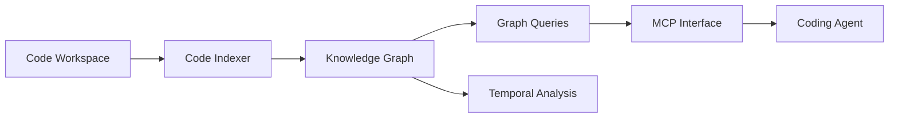

# syncable-dev/memtrace-public

> Graphe de connaissance local du code, interrogé par agents via MCP, avec historique temporel.

## Le problème
Les agents de code relisent des fichiers et refactorent sans voir les dépendances ni l'historique.

## Ce que ça fait vraiment
Indexe un dépôt (Rust, Tree-sitter, 16+ langages) en graphe d'appels sans appel LLM, expose plus de 25 outils MCP (recherche hybride, impact, code mort, évolution temporelle, topologie d'API) et 17 skills. Installation automatique pour Claude Code, Cursor, Codex, etc. Les chiffres de benchmark sont ceux de l'éditeur. Le dépôt public ne contient aucun code source : seul le README a été vu.

## Comment c'est branché


## Essayer
```bash
npm install -g memtrace
claude mcp add memtrace -- memtrace mcp
MEMTRACE_TELEMETRY=off memtrace start
```

## Coût et pièges
Bêta privée : le README demande une liste d'attente. Validation de licence en ligne ; télémétrie opt-out. 8 Go de RAM minimum.

## Ce que ce n'est pas
Pas open source vérifiable : dépôt de distribution sans code, licence non identifiée. Pas une mémoire conversationnelle (Mem0, Graphiti).

## Alternatives
- GitNexus et CodeGrapherContext : graphes AST comparés dans le README.
- Mem0, Graphiti : mémoire conversationnelle, plus lents sur du code.

## Pour toi
À surveiller : l'idée est bonne mais binaire fermé en bêta et chiffres auto-déclarés ; attends un accès et des tests indépendants.

