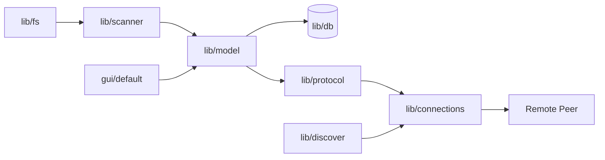

# syncthing/syncthing

> Synchronisation continue de fichiers en pair à pair entre ses propres machines, sans serveur central.

## Le problème
Garder des dossiers identiques sur plusieurs machines sans confier ses fichiers à un cloud tiers.

## Ce que ça fait vraiment
Chaque machine fait tourner la même instance : elle surveille le disque (`lib/fs`, `lib/scanner`), indexe l'état des fichiers (`lib/model`, `lib/db`), trouve les pairs (`lib/discover`, `lib/beacon`) et échange via son protocole (`lib/protocol`), en direct ou par relais (`lib/relay`).
Des services d'infrastructure (`stdiscosrv`, `strelaysrv`) assurent découverte et relais ; une interface web (`gui/default`) configure et suit l'ensemble.
Binaires signés GPG, mise à jour automatique signée ECDSA. L'analyse d'architecture fournie est générique mais cite les vrais dossiers.

## Comment c'est branché


## Essayer
```bash
go run build.go
```

## Coût et pièges
Gratuit. Construire depuis les sources demande Go ; sinon, les binaires publiés. Licence MPL-2.0, copyleft au niveau du fichier.

## Ce que ce n'est pas
Pas une sauvegarde : c'est de la synchronisation, une suppression se propage. Pas un service de partage public : l'outil vise l'individu et ses appareils. Le README renvoie tout le détail vers la documentation externe.

## Alternatives
Aucune alternative nommée dans le README.

## Pour toi
Utile en perso, hors de ton périmètre data / IA : à ignorer pour la veille.
