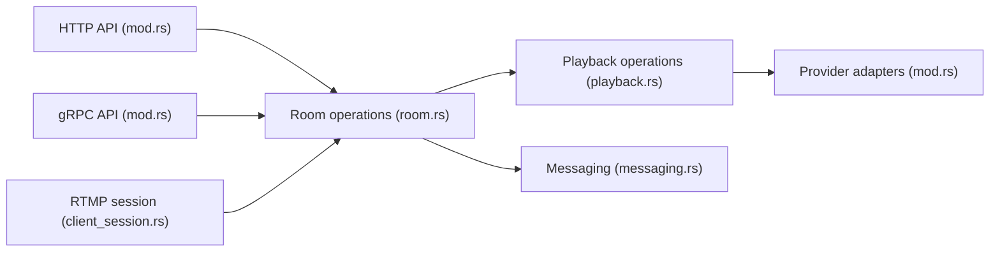

# synctv-org/synctv

> Plateforme en Rust de visionnage vidéo synchronisé, avec direct et fournisseurs de médias.

## Le problème
Regarder la même vidéo en même temps à distance, avec lecture synchronisée.

## Ce que ça fait vraiment
Des salles synchronisent l'état de lecture en temps réel. Fournisseurs de médias nombreux (Bilibili, Twitch, YouTube, Alist, Emby/Jellyfin, Nextcloud…), publication WHIP et RTMP, lecture WHEP, HLS et HTTP-FLV, relais de direct entre nœuds. Surfaces HTTP, gRPC, WebSocket ; stockage PostgreSQL, Redis optionnel ; modèles Docker Compose et Helm.

## Comment c'est branché

## Essayer
Aucune commande dans le README ; voir docs.syncs.tv.

## Coût et pièges
PostgreSQL requis, Redis pour le mode cluster. Le README ne donne ni prérequis matériels ni exemples d'installation.

## Ce que ce n'est pas
Pas un outil d'IA ou de données. Les fournisseurs tiers dépendent de services externes qui peuvent changer.

## Alternatives
Aucune alternative nommée dans le README.

## Pour toi
À ignorer : plateforme de visionnage synchronisé sans lien avec data, IA ou MLOps.

