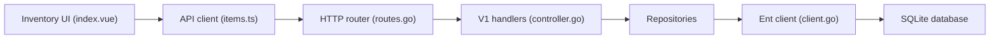

# sysadminsmedia/homebox

> Application auto-hébergée d'inventaire du foyer, avec emplacements, étiquettes, pièces jointes et suivi.

## Le problème
Savoir où sont les objets de la maison, leurs garanties et leurs entretiens.

## Ce que ça fait vraiment
Organisation par catégories, emplacements et tags, champs personnalisés, recherche, photos, documents et garanties, achat et maintenance, export, génération d'étiquettes. Go avec SQLite et interface web embarquée ; API versionnée, authentification dont OIDC (d'après le schéma).

## Comment c'est branché


## Essayer
```bash
openssl rand -base64 48 > hbox.pepper
chmod 400 hbox.pepper
docker run -d --name homebox --restart unless-stopped --publish 3100:7745 \
  --env HBOX_AUTH_API_KEY_PEPPER=$(cat hbox.pepper) \
  --volume /path/to/data/folder/:/data ghcr.io/sysadminsmedia/homebox:latest
```

## Coût et pièges
Gratuit. Le dossier de données doit appartenir à l'UID 65532 pour les images rootless et hardened. AGPL-3.0.

## Ce que ce n'est pas
Pas un outil d'inventaire d'entreprise. Mémoire « moins de 50 Mo au repos » : affirmation du README.

## Alternatives
Aucune nommée ; projet issu de l'original de hay-kot.

## Pour toi
À ignorer pour la veille pro : un homelab utile, mais sans lien avec data/IA/MLOps.

