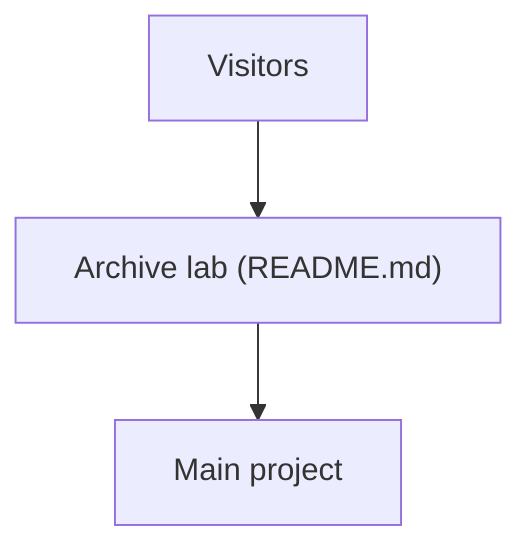

# t41372/Open-LLM-VTuber

> Fork d'archivage personnel qui renvoie vers le vrai projet Open-LLM-VTuber, sans contenu propre.

## Le problème
Des liens anciens pointent ici après la rupture d'une redirection GitHub, et les visiteurs atterrissent sur le mauvais dépôt.

## Ce que ça fait vraiment
Rien de fonctionnel : le README explique l'historique (transfert vers l'organisation, nouveau fork d'archive) et redirige vers Open-LLM-VTuber/Open-LLM-VTuber. Le dépôt sert à archiver des branches et des expériences ; seul le README est fourni.

## Comment c'est branché

## Essayer
Aucune commande documentée : aller sur Open-LLM-VTuber/Open-LLM-VTuber.

## Coût et pièges
Aucun. Piège : cloner ici donne une archive d'expériences, pas le produit.

## Ce que ce n'est pas
Pas le projet Open-LLM-VTuber lui-même. Pas de licence déclarée. Dernier push le 2026-02-14.

## Alternatives
Open-LLM-VTuber/Open-LLM-VTuber, le dépôt principal cité par le README.

## Pour toi
Ignorer : simple panneau de redirection ; va directement au dépôt principal.

