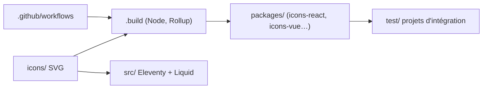

# tabler/tabler-icons

> Jeu de 6 202 icônes SVG MIT, diffusé en paquets par framework, pour interfaces web.

## Le problème
Trouver des icônes cohérentes (grille 24x24, trait de 2 px) dans chaque format : SVG brut, sprite, police, composants React, Vue, Svelte ou Angular.

## Ce que ça fait vraiment
Un dépôt d'icônes (5 148 en trait, 1 054 remplies) et des paquets npm au même numéro de version : `@tabler/icons`, sprite, webfont, composants React, React Native, Preact, Vue, Svelte 4 et 5, SolidJS, Astro, Angular, PNG, PDF, EPS. Le trait se règle en CSS. Les scripts de `.build` génèrent les paquets, un site Eleventy présente les icônes.

## Comment c'est branché


## Essayer
```bash
npm install @tabler/icons
yarn add @tabler/icons
pnpm add @tabler/icons
```

## Coût et pièges
Gratuit. Remplacer `@tabler/icons` par le paquet du framework voulu. En CDN, épingler la version plutôt que `latest`.

## Ce que ce n'est pas
Pas un kit de composants d'interface : ce sont seulement des icônes.

## Alternatives
Aucune alternative citée dans le README.

## Pour toi
Adopter si tu fais une interface (Streamlit non, mais React, Vue ou Svelte) pour un outil de données : c'est un choix sans risque, licence MIT.

