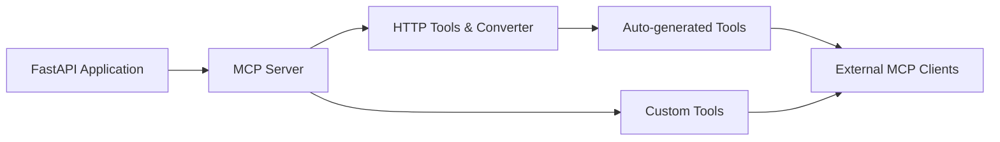

# tadata-org/fastapi_mcp

> Extension FastAPI qui expose automatiquement tes endpoints comme outils MCP pour agents IA.

## Le problème
Rendre une API existante utilisable par un agent via MCP oblige à réécrire chaque endpoint sous forme d'outil.

## Ce que ça fait vraiment
`FastApiMCP(app).mount()` publie un serveur MCP sur `/mcp` à partir des routes FastAPI.
Conserve schémas de requête/réponse et documentation Swagger des endpoints.
Authentification via les dépendances `Depends()` existantes.
Transport ASGI direct vers l'app (pas d'appel HTTP interne) ; déploiement joint ou séparé.

## Comment c'est branché


## Essayer
```bash
uv add fastapi-mcp
pip install fastapi-mcp
```

## Coût et pièges
Gratuit, MIT ; Python 3.10+. Offre hébergée payante tadata.com en option.
Tous tes endpoints deviennent des outils : filtrer ce qui est exposé à un agent.

## Ce que ce n'est pas
Pas un convertisseur OpenAPI générique : fonctionne avec une app FastAPI, pas d'autres frameworks.
Pas un client MCP.

## Alternatives
Aucune alternative nommée dans le README.

## Pour toi
À adopter : si tes modèles sont servis en FastAPI, c'est le chemin le plus court pour les rendre appelables par un agent, avec ton auth existante.
