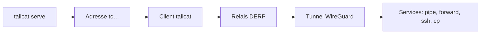

# tailscale/tailcat

> Netcat chiffré par WireGuard, sur le plan de données de Tailscale, sans compte ni plan de contrôle.

## Le problème
Relier deux machines derrière des NAT, de manière chiffrée, sans VPN, root ni compte Tailscale.

## Ce que ça fait vraiment
Un côté lance un serveur et obtient une adresse `tc…` ; l'autre s'y connecte. Trafic passant par un relais DERP, puis en direct par traversée de NAT si possible. Services : tube stdin/stdout, redirection de ports, SSH, commande par connexion, transfert de fichiers, SOCKS5, nœud de sortie. Bibliothèque Go et démo WebAssembly.

## Comment c'est branché


## Essayer
```bash
tailcat
echo hello | tailcat tcXXXXXXXXX
tailcat serve 8080,8443
tailcat recv ~/inbox
tailcat cp report.pdf tcXXXXXXXXX:
```

## Coût et pièges
Gratuit ; relais publics limités en débit, sans SLA et révocables. L'adresse est un secret : `no-auth-ssh` donne un shell à qui la connaît. Aucune garantie de stabilité d'API.

## Ce que ce n'est pas
Pas un VPN complet ni un produit Tailscale : pas de routage ni de DNS modifiés.

## Alternatives
Aucune alternative nommée dans le README.

## Pour toi
Surveiller : pratique pour passer un port ou un fichier entre machines (GPU distant, notebook), mais jeune et sans stabilité promise.

