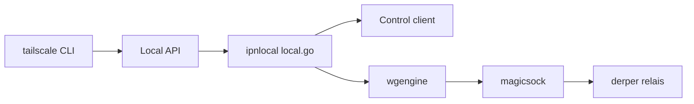

# tailscale/tailscale

> Client open source du réseau privé WireGuard de Tailscale : démon `tailscaled` et CLI `tailscale`.

## Le problème
Relier des machines (postes, serveurs GPU, conteneurs) entre elles de façon sûre, sans ouvrir de ports ni gérer soi-même les clés et les NAT.

## Ce que ça fait vraiment
Le démon `tailscaled` s'enregistre auprès d'un service de contrôle hébergé, reçoit la carte du réseau (pairs, politiques, DNS, routes), puis configure le moteur WireGuard. `magicsock` tente une connexion UDP directe et retombe sur des relais DERP. Le dépôt contient aussi le relais `derper`, un opérateur Kubernetes et des services optionnels (SSH, partage de fichiers).

## Comment c'est branché


## Essayer
```bash
go install tailscale.com/cmd/tailscale{,d}
./build_dist.sh tailscale.com/cmd/tailscale
./build_dist.sh tailscale.com/cmd/tailscaled
```
Des paquets prêts à installer sont servis sur https://pkgs.tailscale.com.

## Coût et pièges
Le client est libre mais le service de contrôle est hébergé par Tailscale : compte requis, et l'offre gratuite a des limites que le README ne détaille pas. Go 1.27 pour compiler. Les interfaces graphiques macOS, iOS et Windows ne sont pas ouvertes.

## Ce que ce n'est pas
Ce n'est pas une solution 100 % autonome : le plan de contrôle reste chez Tailscale. Le dépôt n'inclut pas les applications mobiles graphiques. 4 622 issues ouvertes.

## Alternatives
Aucune alternative nommée dans le README.

## Pour toi
À adopter pour relier ta machine, un serveur GPU et un cluster sans exposer de ports ; accepte la dépendance au service de contrôle hébergé.

