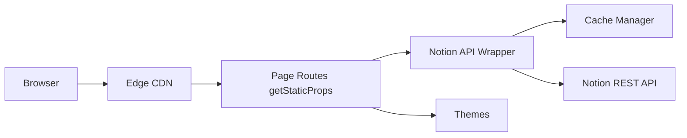

# tangly1024/NotionNext

> Générateur de site (blog, doc, portfolio) qui publie des pages Notion via Next.js sur Vercel.

## Le problème
Publier un blog ou une base de connaissances sans quitter Notion, sans monter soi-même un CMS.

## Ce que ça fait vraiment
Un site Next.js lit les pages Notion via l'API (wrapper dans lib/notion), les pré-rend en SSG/ISR et les sert depuis Vercel. Un cache à trois niveaux (mémoire, fichier local, Redis) évite de rappeler Notion. 26 thèmes intégrés, commentaires (Twikoo, Giscus…), recherche Algolia, analytics.

## Comment c'est branché


## Essayer
```bash
nvm use || nvm install
npm i -g yarn
yarn
yarn dev
```

## Coût et pièges
Compte Notion et compte Vercel nécessaires. Node 22 exigé (Node 20 ne s'installe plus). README majoritairement en chinois.

## Ce que ce n'est pas
Pas un outil data/IA. Le README dit « gratuit, usage personnel et légal » sans licence déclarée dans le catalogue : réutilisation à vérifier.

## Alternatives
- Nobelium : projet dont NotionNext est dérivé (remerciements).
- Elog : export Markdown depuis Notion vers Hexo, VitePress, WordPress.

## Pour toi
Hors sujet pour un profil data/IA/MLOps : c'est un générateur de blog, utile seulement si tu veux publier tes notes depuis Notion.
