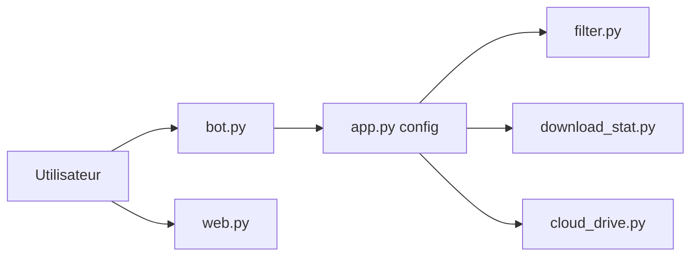

# tangyoha/telegram_media_downloader

> Télécharge les médias de canaux et groupes Telegram, avec bot de commande et interface web.

## Le problème
Récupérer en masse photos, vidéos et documents d'un canal Telegram à la main est fastidieux.

## Ce que ça fait vraiment
Deux modes : bot Telegram (commandes `download` et `forward`) ou téléchargement ponctuel. Configuration YAML : chats, filtres de date, types et formats de médias, arborescence des fichiers, jusqu'à 5 tâches parallèles. Interface web sur le port 5000, envoi facultatif vers un cloud via rclone ou aligo, proxy socks/http.

## Comment c'est branché


## Essayer
```bash
git clone https://github.com/tangyoha/telegram_media_downloader.git
cd telegram_media_downloader
make install
python3 media_downloader.py
```

## Coût et pièges
Gratuit, mais il faut une paire `api_id`/`api_hash` Telegram et la connexion par numéro de téléphone au premier lancement. L'automatisation d'un compte Telegram peut être restreinte par la plateforme (non précisé dans le README).

## Ce que ce n'est pas
Pas un outil d'archivage juridique ni de scraping de données structurées : il copie des fichiers de médias.

## Alternatives
Aucune alternative nommée dans le README.

## Pour toi
Ignorer : sauf besoin ponctuel de collecter des médias pour un jeu de données, rien dans le dépôt ne concerne data/IA/MLOps.

