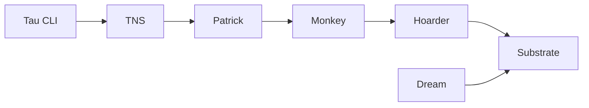

# taubyte/tau

> Plateforme cloud pair-à-pair en Go pour déployer fonctions WebAssembly, sites web et bases, pour développeurs.

## Le problème
Héberger fonctions, sites, stockage et messagerie demande d'assembler plusieurs services cloud. Tau propose une plateforme unique, auto-hébergeable.

## Ce que ça fait vraiment
D'après l'architecture décrite d'après le code : un nœud Go compose des services (Auth, TNS, Patrick, Monkey, Hoarder, Seer, Substrate). Le CLI `tau` édite des dépôts Git de configuration ; les builds produisent du WebAssembly ou des ressources web, répliquées puis servies par Substrate. Dream lance un environnement local multi-nœuds ; Spore Drive déploie sur des serveurs. Le README lui-même est très court : le reste n'est pas documenté ici.

## Comment c'est branché


## Essayer
```bash
# Aucune commande dans le README ; il renvoie à la documentation :
# https://tau.how/getting-started/local-cloud   (environnement local avec dream)
# https://tau.how/platform/deployment           (déploiement manuel)
# https://tau.how/platform/spore-drive          (déploiement automatisé)
```

## Coût et pièges
Gratuit ; les serveurs ou VM d'un déploiement réel sont à ta charge. Les builds passent par Docker ou containerd d'après le code. Compte à créer : non documenté.

## Ce que ce n'est pas
Ce n'est pas un outil d'IA ou de données : c'est une plateforme d'applications. Le README (moins de 800 caractères) ne permet pas de juger la prise en main ; tout passe par un site externe.

## Alternatives
Non documenté : le README ne cite aucun dépôt alternatif.

## Pour toi
À surveiller : intérêt limité pour un profil data/IA/MLOps tant que tu n'as pas besoin d'un cloud auto-hébergé ; README trop maigre pour trancher plus.
