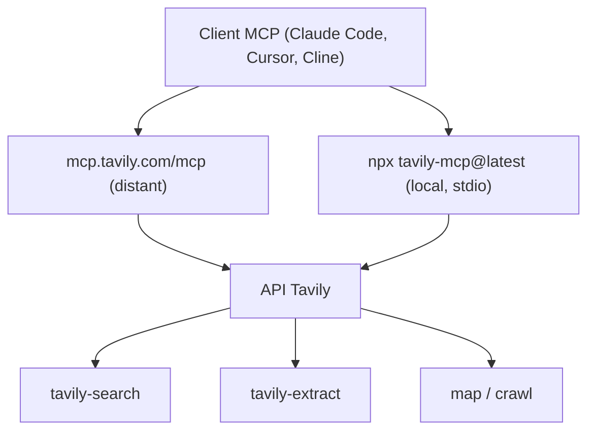

# tavily-ai/tavily-mcp

> Serveur MCP officiel Tavily : recherche web, extraction, cartographie et crawl pour un agent.

## Le problème
Un agent sans accès web répond sur ses souvenirs ; brancher un moteur de recherche à la main
demande un scraper, un parseur et une gestion de quota.

## Ce que ça fait vraiment
Expose quatre outils : `tavily-search` (recherche web temps réel), `tavily-extract`
(extraction de contenu depuis des pages), un outil de cartographie qui construit une carte
structurée d'un site, et un crawler qui explore systématiquement. Deux modes de déploiement :
le serveur distant `https://mcp.tavily.com/mcp/` (clé dans l'URL, en-tête `Authorization:
Bearer`, ou flux OAuth complet) ou l'exécution locale via `npx tavily-mcp@latest`. Des
paramètres par défaut se poussent globalement via l'en-tête ou la variable
`DEFAULT_PARAMETERS` (JSON : `include_images`, `search_depth`, `max_results`).

## Comment c'est branché


## Essayer
```bash
claude mcp add --transport http tavily https://mcp.tavily.com/mcp/?tavilyApiKey=<your-api-key>
claude mcp add --transport http tavily https://mcp.tavily.com/mcp
claude mcp add --transport http --scope user tavily https://mcp.tavily.com/mcp/?tavilyApiKey=<your-api-key>
npx -y tavily-mcp@latest
export DEFAULT_PARAMETERS='{"include_images": true}'
rm -rf ~/.mcp-auth
```

## Coût et pièges
Compte Tavily obligatoire, clé d'API à ta charge (offre gratuite annoncée à l'inscription).
Node v20+ pour le mode local. Le choix de la clé utilisée après OAuth suit une règle précise :
une clé nommée `mcp_auth_default` en compte personnel prime sur celle de l'équipe. La variable
optionnelle `TAVILY_HUMAN_ID` envoie un en-tête `X-Human-Id` par appel — hashé côté serveur en
SHA-256, mais le README recommande des identifiants opaques plutôt que des e-mails.

## Ce que ce n'est pas
Ce n'est pas un moteur de recherche gratuit ni auto-hébergeable : tout passe par l'API Tavily.
La variante distante implique que tes requêtes transitent par leur infrastructure. Aucun
contrôle sur l'index.

## Alternatives
- Aucune alternative nommée dans le README ; il cite seulement des tutoriels d'intégration
  avec le MCP Neo4j et avec Cline dans VS Code.

## Pour toi
La façon la plus courte de donner une recherche web sérieuse à tes agents, si la facture Tavily passe.
