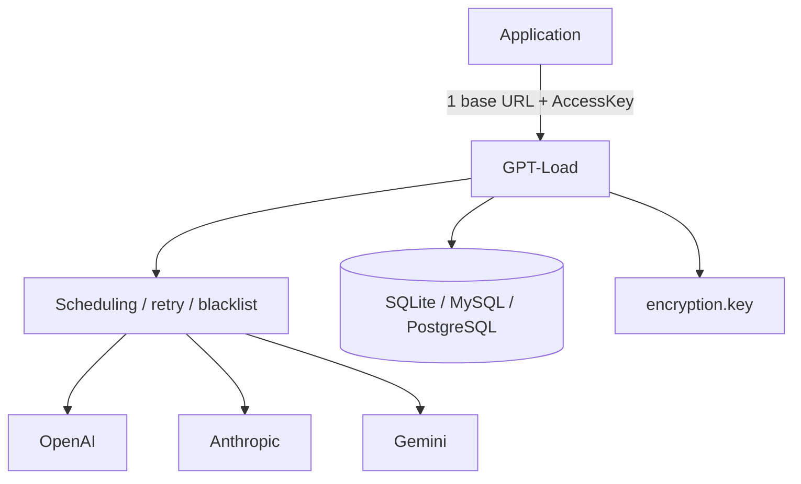

# tbphp/gpt-load

> Passerelle IA auto-hébergée pour gérer plusieurs canaux et credentials derrière une seule entrée.

## Le problème
Multiplier fournisseurs, comptes et clés d'API LLM oblige chaque application à gérer routage, quotas, pannes et comptabilité. Aucune vue unifiée.

## Ce que ça fait vraiment
Une seule base URL et une AccessKey pour l'application ; fournisseurs, comptes, modèles et routage configurés dans l'UI. Protocoles natifs : OpenAI, Anthropic Messages, Gemini, plus Responses, Images, Embeddings, Rerank. Ordonnancement multi-credential, poids, retries, cooldown, blacklist, affinité de session. Canaux abonnement (Codex, Claude, Antigravity, Grok) via OAuth. UI d'observabilité, SQLite/MySQL/PostgreSQL, credentials chiffrés localement.

## Comment c'est branché


## Essayer
```bash
git clone --depth 1 https://github.com/tbphp/gpt-load.git
cd gpt-load
cp .env.example .env
docker compose up -d
```

## Coût et pièges
Auto-hébergé gratuit, mais clés d'API des fournisseurs à ta charge. `encryption.key` doit être sauvegardé avec la base (pas de rotation). Écoute sur loopback par défaut. Conçu pour une seule instance (pas de scaling horizontal). 2.0 ne migre pas les données 1.x.

## Ce que ce n'est pas
Pas un traducteur universel n'importe-quel-protocole. Coûts et usage sont des **estimations**, pas une facture fournisseur.

## Alternatives
- one-api / new-api : passerelles concurrentes mentionnées en contexte.

## Pour toi
Pratique si tu jongles avec plusieurs comptes/clés LLM et veux une entrée unique observable ; attention mainteneur unique.
